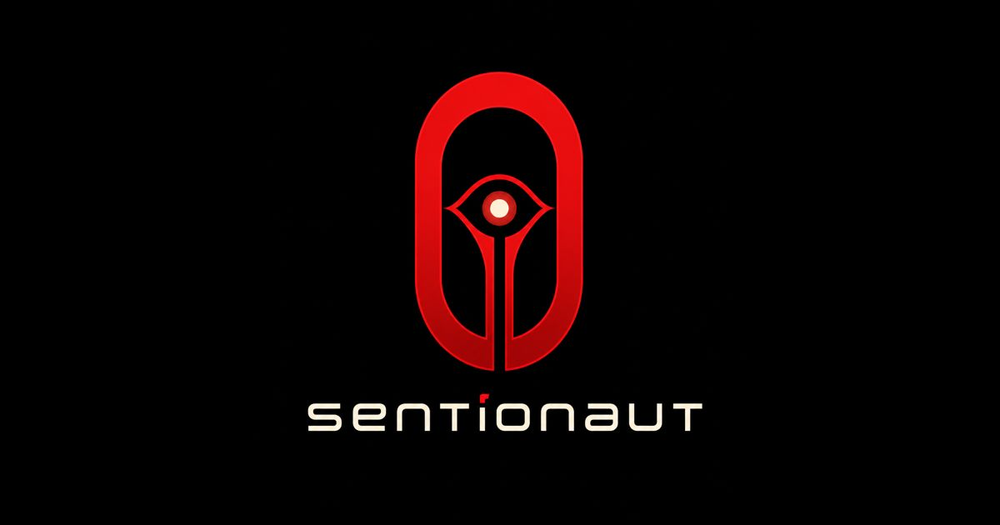
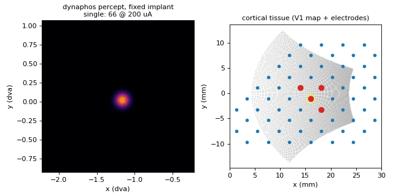

<p align="center">
  <a href="https://ascientist.github.io/sentionaut/">
    
  </a>
</p>

<p align="center">
  <strong>Differentiable, GPU-native world models of prosthetic vision.</strong><br>
  Retinal and cortical phosphene physics in PyTorch, behind one <code>f(s<sub>t</sub>, a<sub>t</sub>) → s<sub>t+1</sub></code> interface.
</p>

<p align="center">
  <a href="https://ascientist.github.io/sentionaut/"></a>
  <a href="https://github.com/ascientist/sentionaut/actions/workflows/ci.yml"></a>
  <a href="https://github.com/ascientist/sentionaut/actions/workflows/docs.yml"></a>
  
  
</p>

<p align="center">
  <a href="https://ascientist.github.io/sentionaut/"><b>Documentation</b></a> ·
  <a href="https://ascientist.github.io/sentionaut/getting-started/">Getting started</a> ·
  <a href="https://ascientist.github.io/sentionaut/user-guide/">User guide</a> ·
  <a href="https://ascientist.github.io/sentionaut/models/">Models</a> ·
  <a href="https://ascientist.github.io/sentionaut/neurostim-formulation/">Closed-loop control</a> ·
  <a href="https://ascientist.github.io/sentionaut/references/">References</a>
</p>

---

Sentionaut is a modular PyTorch framework for **prosthetic vision**. It
reimplements [pulse2percept](https://pulse2percept.readthedocs.io)'s retinal
**Biphasic Axon Map** and cortical **Scoreboard** and **Dynaphos** models as
differentiable GPU ports, parity-tested against the reference. Every model
exposes the same world-model interface, so the physics simulators, a learned
transformer world model and closed-loop stimulation controllers all plug into
one another.

> **New to Sentionaut?** The
> [documentation](https://ascientist.github.io/sentionaut/) explains the
> framework from the ground up: what each model predicts, how the pieces fit
> together, and how to reproduce every figure. Start with
> [Getting started](https://ascientist.github.io/sentionaut/getting-started/),
> then read [how the stimulation demos work](https://ascientist.github.io/sentionaut/models/demos/).

<table>
  <tr>
    <td align="center" width="33%">
      <a href="https://ascientist.github.io/sentionaut/models/axonmap/"></a><br>
      <sub><b><a href="https://ascientist.github.io/sentionaut/models/axonmap/">Axon map</a></b> · retinal</sub>
    </td>
    <td align="center" width="33%">
      <a href="https://ascientist.github.io/sentionaut/models/scoreboard/"></a><br>
      <sub><b><a href="https://ascientist.github.io/sentionaut/models/scoreboard/">Scoreboard</a></b> · cortical</sub>
    </td>
    <td align="center" width="33%">
      <a href="https://ascientist.github.io/sentionaut/models/dynaphos/"></a><br>
      <sub><b><a href="https://ascientist.github.io/sentionaut/models/dynaphos/">Dynaphos</a></b> · cortical</sub>
    </td>
  </tr>
</table>
<p align="center"><sub>One fixed zone of electrodes, one stimulation sequence, three phosphene models. <a href="https://ascientist.github.io/sentionaut/models/demos/">How to read these clips →</a></sub></p>

## Highlights

- **Swappable components.** Implant, topography and percept model are
  independent axes of a single `Config`: 9 implants (Argus II, Alpha IMS/AMS,
  PRIMA, grid; Orion, Cortivis, ICVP, Neuralink), retinal and cortical maps.
- **Differentiable physics on GPU.** CUDA, Apple MPS or CPU, with gradients
  through every model. Parity with pulse2percept 0.9.0 to within 3e-5 max-abs error
  ([details](https://ascientist.github.io/sentionaut/user-guide/#parity-with-pulse2percept)).
- **Learned world models.** A conditioned ViT-style
  [world model](https://ascientist.github.io/sentionaut/models/world-model/)
  trained on simulator transitions, evaluated against per-model specialists,
  plus a distilled [axon-map world model](https://ascientist.github.io/sentionaut/models/axonmap-world/).
- **Closed-loop control benchmarks.**
  [NeuroStim](https://ascientist.github.io/sentionaut/neurostim/) environments
  with baselines from bandits to PPO-Lagrangian, and
  [image targets](https://ascientist.github.io/sentionaut/neurostim-percept/)
  learned through a world model.

## Installation

Sentionaut uses [uv](https://docs.astral.sh/uv/) and Python 3.11+.

```bash
git clone https://github.com/ascientist/sentionaut.git
cd sentionaut
make setup        # uv sync --extra dev
```

## Quickstart

```python
import torch
from sentionaut.core.config import Config
from sentionaut.core.registry import build_components
from sentionaut.core.base import Action

cfg = Config(model="axonmap", implant="argusii", xrange=(-8, 8), yrange=(-8, 8), xystep=0.5)
implant, topo, model = build_components(cfg)        # CUDA → MPS → CPU
amp = torch.zeros(implant.n_electrodes); amp[20] = 2.0
percept = model.forward(Action(amp=amp,
                               freq=torch.full_like(amp, 30.0),
                               phase_dur=torch.full_like(amp, 0.45)))
```

Swap `model="scoreboard"` or `"dynaphos"` with a cortical implant to change
the physics. Action fields, amplitude units and the state schema are in the
[User guide](https://ascientist.github.io/sentionaut/user-guide/#action-and-state-schema).

## Models

| Model | Tissue | Paper | Docs |
| --- | --- | --- | --- |
| Axon map | retinal | Granley & Beyeler 2021 | [page](https://ascientist.github.io/sentionaut/models/axonmap/) |
| Scoreboard | cortical | Beyeler et al. 2019 | [page](https://ascientist.github.io/sentionaut/models/scoreboard/) |
| Dynaphos | cortical | van der Grinten et al. 2024 | [page](https://ascientist.github.io/sentionaut/models/dynaphos/) |
| World model | multi | learned | [page](https://ascientist.github.io/sentionaut/models/world-model/) |
| Axon-map world model | retinal | distilled from axon map | [page](https://ascientist.github.io/sentionaut/models/axonmap-world/) |

Every model maps electrode stimulation to a visual percept (`brain2vision`, see
[Nomenclature](https://ascientist.github.io/sentionaut/nomenclature/)). Full
citations: [References](https://ascientist.github.io/sentionaut/references/).

## Closed-loop control

`sentionaut.neurostim` frames stimulation as control: find the pulses that
drive a patient's neural state to a target, when the patient is unknown,
drifts and is only partly observed.

```python
from sentionaut.neurostim import make
env = make("NeuroStim-v0")          # also NeuroStim-Easy-v0, NeuroStim-Hard-v0
obs, info = env.reset(seed=0)
obs, r, terminated, truncated, info = env.step(env.action_space.sample())
```

| Tutorial | Command | Docs |
| --- | --- | --- |
| Canonical formulation: random drifting linear systems, exact baselines | `make neurostim-canonical` | [read](https://ascientist.github.io/sentionaut/neurostim-formulation/) |
| NeuroStim toy CMDP: bandit → system ID → PPO-Lagrangian → DAgger | `make neurostim` | [read](https://ascientist.github.io/sentionaut/neurostim/) |
| NeuroStim-Percept: MNIST targets learned through a world model | `make neurostim-percept` | [read](https://ascientist.github.io/sentionaut/neurostim-percept/) |

## Common tasks

| Task | Command |
| --- | --- |
| Interactive Streamlit demo | `make demo` |
| Render model animations / doc demos | `make animate MODEL=all` / `make demos` |
| Generate a world-model dataset | `make world WORLD_DATASET=data/world.h5` |
| Train / ablate the learned world model | `make train` / `make ablate` |
| Run fast tests (incl. pulse2percept parity) | `make test` |
| Lint and format check | `make lint` / `make format` |

Options, outputs and SLURM launchers for cluster runs are described in the
[User guide](https://ascientist.github.io/sentionaut/user-guide/#common-tasks).

## Documentation

The full documentation lives at
**[ascientist.github.io/sentionaut](https://ascientist.github.io/sentionaut/)**
and is rebuilt from [`docs/`](docs/index.md) on every push to `main`.

| Page | What it covers |
| --- | --- |
| [Getting started](https://ascientist.github.io/sentionaut/getting-started/) | Install and a first percept |
| [User guide](https://ascientist.github.io/sentionaut/user-guide/) | Schema, workflows, parity, cluster runs, package layout |
| [Stimulation demos](https://ascientist.github.io/sentionaut/models/demos/) | What the demo clips show, step by step |
| [Model catalog](https://ascientist.github.io/sentionaut/models/) | One page per model, with equations and papers |
| [Canonical formulation](https://ascientist.github.io/sentionaut/neurostim-formulation/) | The closed-loop stimulation problem, stated precisely |
| [Nomenclature](https://ascientist.github.io/sentionaut/nomenclature/) | How models are classified by modality |

Build it locally with `make docs` (→ `site/`) or preview with `make docs-serve`
(→ `localhost:8000`).

## Project layout

```
src/sentionaut/   core, implants, topography, models, learned, neurostim
examples/         NeuroStim tutorials (runnable scripts, # %% cells)
docs/             documentation source (Zensical)
configs/          training and ablation configs
scripts/          SLURM launchers for cluster runs
tests/            parity and smoke tests
```

Module-level detail: [User guide → Package layout](https://ascientist.github.io/sentionaut/user-guide/#package-layout).
Design decisions and sourced parameter values: [`DEBRIEF.md`](DEBRIEF.md).
