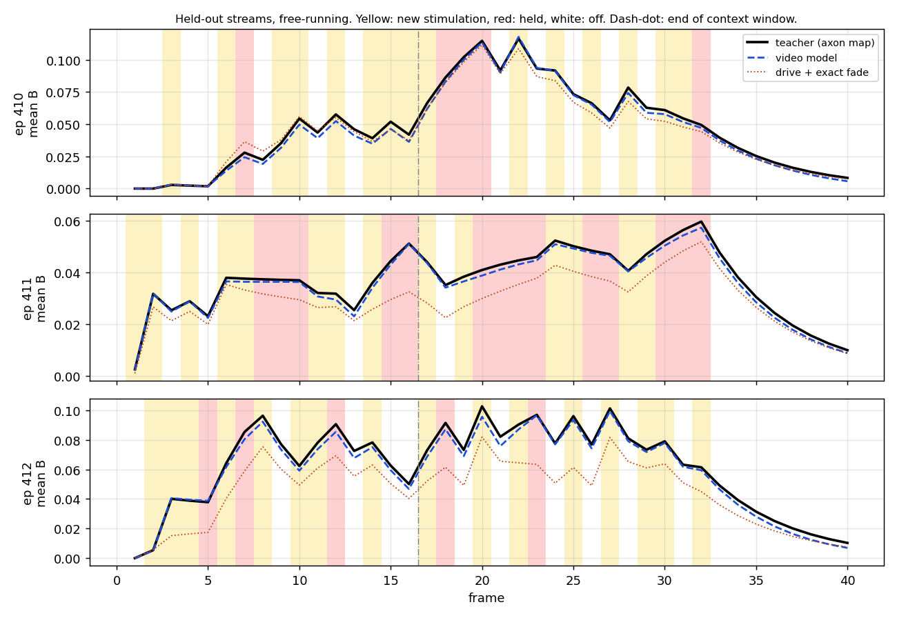
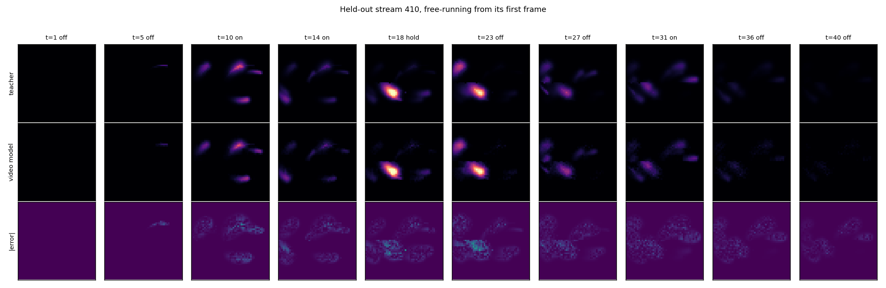
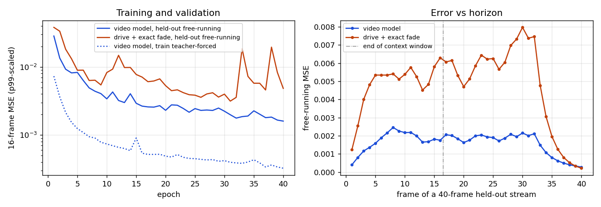

# Axon-map video world model

[Home](../index.md) · [Getting started](../getting-started.md) · [Nomenclature](../nomenclature.md) · [Models](index.md) · [References](../references.md)

**Modality:** `brain2vision` · **Tissue:** retinal

The [axon-map world model](axonmap-world.md) learns the spatial drive and is
handed the fade: its temporal step is the teacher's own leaky integrator. This
model is handed nothing temporal. It watches the axon map as a video stream and
predicts the next frame from a window of past frames and stimulations, so the
fade, the rise under sustained stimulation, and the threshold at zero all have
to come out of the data.

## What the teacher can teach

It is worth being exact about which biological artefacts the axon map has,
because a student cannot learn one its teacher lacks.

| artefact | where it lives in the teacher | learned by |
| --- | --- | --- |
| axonal streaks, elongated along the nerve fibre | `axlambda` and the Jansonius bundles | both students |
| phosphene size and brightness vs amplitude, frequency, pulse width | Granley 2021 `F_size`, `F_bright`, `F_streak` | both students |
| subject-specific spread | `rho`, `axlambda` per retina | both students |
| **fade after stimulation stops** | leaky integrator, `tau` = 100 ms | video model only |
| **rise toward a plateau under held stimulation** | the same integrator | video model only |
| no negative brightness | threshold at `thresh_percept` = 0 | video model only (see below) |

That is the whole temporal repertoire of the axon map: one first-order
integrator and a threshold. Habituation, charge accumulation, and
multi-electrode interaction over time are not in it. [Dynaphos](dynaphos.md)
carries charge and activation state, and a teacher like that is where the
video model's memory stops being optional, because the frame alone is then not
the state. For the axon map, the current frame is a sufficient state, so a
window of past frames is more than it needs; the point of this model is that
it gets the dynamics without being told the equation.

## Video streams from the teacher

The earlier distillation data drew an independent random stimulation every
frame, which almost never shows the integrator settling. With `--stream`, the
teacher writes episodes that look like a stimulation protocol:

- a held step repeats the previous stimulation (`--hold-prob`, default 0.5),
  so brightness climbs toward its plateau;
- a gap turns every electrode off (`--silent-prob`, default 0.3), so it fades;
- `rho` and `axlambda` are drawn once per episode, because one video is one
  retina;
- a silent tail at the end of each episode shows the full decay.

```bash
uv run sentionaut-world --output data/axon_stream.h5 --model axonmap --stream \
    --episodes 512 --sequence-length 32 --silent-tail 8 \
    --xrange -12 12 --yrange -12 12 --xystep 0.5
```

## Architecture, and what comes from Genie

Genie (Bruce et al., 2024) is a world model learned from unlabelled video. Its
dynamics model is a spatiotemporal (ST) transformer: attention across patches
inside a frame, then causal attention across frames at each patch, which costs
`T·N² + N·T²` instead of `(T·N)²` for `T` frames of `N` patches. That block is
what this model takes.

Each `STBlock` is, in order:

1. cross-attention from the frame's patches to its electrode tokens
   `(x, y, amplitude, frequency, phase duration)`, plus one always-valid null
   token so a frame with every electrode off is well defined;
2. self-attention across the patches of that frame;
3. causal self-attention across frames, per patch position;
4. an MLP.

`rho` and `axlambda` modulate the per-frame layers through adaptive layer norm,
as in the specialist student. The output is a correction added to the current
frame and clipped at zero. That correction starts at exactly zero, so the
untrained model predicts that nothing ever fades (`tau` = infinity), and any
decay it ends up with was learned.

Two parts of Genie are deliberately left out:

- **The latent action model.** Genie infers actions because game footage has no
  controller log. The stimulation here is known, so it enters directly.
- **VQ tokens and MaskGIT.** Brightness is a smooth scalar field, so frames stay
  continuous and the loss is MSE on them.

Training is teacher-forced: one causal pass over a 16-frame window supervises
all 16 next frames. Context frames get small Gaussian noise (GameNGen,
Valevski et al., 2024), so the model learns to correct slightly wrong inputs
instead of trusting them. That is what running free on its own predictions
feeds it. Validation is free-running from the first frame.

```bash
uv run sentionaut-axon-video train --dataset data/axon_stream.h5 \
    --ckpt data/axon_video.pt --epochs 40 --batch-size 16
uv run sentionaut-axon-video report --dataset data/axon_stream.h5 \
    --ckpt data/axon_video.pt --baseline-ckpt data/axon_stream_markov.pt
```

`step(state, action)` keeps the teacher's contract; the context window rides in
`State.aux`, so the same rollout loop drives either model.

## On the cluster

The reference run is one Mila job on one GPU:

```bash
sbatch scripts/mila_axon_video.sh                        # 97×97, the drive student's grid
XYSTEP=0.5 SCALE=half sbatch scripts/mila_axon_video.sh  # 49×49, same as the numbers below
```

It generates the teacher streams on CUDA, trains the video model and the
exact-fade baseline, and writes the report to
`/network/scratch/j/jacob.lavoie/sentionaut/axonvideo/$SCALE/report`. Every stage
resumes. The dataset is renamed into place only once it is complete, both
trainings continue from their per-epoch checkpoints with their timers carried
over, and a training stopped by the pre-timeout `SIGTERM` exits non-zero, so the
report never runs on a half-trained model. Resubmit the same command to
continue. Copy the report directory to `docs/assets/axon-video` to publish it.

## Results

**These are not the cluster numbers.** They come from a CPU-only stand-in run
of the same pipeline (4-core x86-64 container, 15 GB RAM, no GPU,
torch 2.12.1, `make axon-video`) at the half grid, so treat the accuracy as
indicative and the hardware section as a CPU baseline. The cluster job above
replaces them.

**Data.** Argus II, `(-12, 12)` dva at `xystep` 0.5, so a 49×49 grid. That is
half the resolution of the [specialist's results](axonmap-world.md#results),
because spatial attention is quadratic in patches per frame. 512 streams of 40
frames: 32 protocol frames with the default hold and gap probabilities, then 8
silent. That is 20,480 transitions and an 802 MB HDF5. 410 streams train and
102 are held out. Training windows are 16 frames at stride 8 (1282 windows);
validation windows are 16 frames at stride 16 (160).

**Baseline.** The specialist `AxonMapWorld` (learned drive, exact fade) at a
matched size, trained on the same windows with a 16-step unrolled loss.
Everything else is equal: 40 epochs, Adam at 5e-4, batch 16.

| | video model | drive + exact fade |
| --- | --- | --- |
| parameters | 833,488 | 814,224 |
| temporal dynamics | learned | the teacher's integrator |

### The fade is learned

On every held-out silent frame with visible brightness (1763 of them), the next
frame is predicted from the teacher's own context, so only the decay is tested.
The ratio of next to current brightness gives the time constant.

| | teacher | video model |
| --- | --- | --- |
| decay per 20 ms frame, median | 0.800 | 0.797 |
| `tau`, median | 100.0 ms | 98.8 ms |
| `tau`, interquartile range | exact | 96.8 – 100.1 ms |

The model started from `tau` = infinity (zero output correction) and was never
shown the equation.

### Free-running streams

Each held-out stream starts from its first teacher frame and then runs on its own
predictions for all 40 frames, which is 24 more than its context window.



Mean brightness shows the whole integrator: steps up on new stimulation, a
climb toward a plateau while it is held, and the exponential tail once
everything is off. The video model follows all three, and it does not drift
after the context window ends. The baseline's drive comes up short while
stimulation is held, and its exact fade integrates that shortfall into a deficit
that lasts (streams 411 and 412).




Left to right in the GIF: teacher, video model, absolute error, on one shared
brightness scale.

### Training and validation



| free-running, 102 held-out streams × 40 frames | video model | drive + exact fade |
| --- | --- | --- |
| MSE, all frames | 0.00159 | 0.00477 |
| final-epoch validation, 16 frames | 0.00160 | 0.00485 |
| best-epoch validation, 16 frames | 0.00160 | 0.00315 |

Error grows over the first eight frames and then stays flat at about 0.002
through frame 32, past the end of the 16-frame context. On the silent tail both
models converge to the teacher as everything fades to zero. The gap between
teacher-forced training loss (0.0003) and free-running validation is the price
of running on its own output. Context noise is meant to keep that gap from
growing with the horizon; this run has no no-noise ablation to prove it.

The baseline is the harder one to train, not the easier one. Its loss spikes
(epoch 33 above), and in a first attempt at learning rate 1e-3 it collapsed at
epoch 25: the drive's ReLU died, and every later prediction was pure fade.
Backpropagating through 16 exact integrator steps is what the two models do
not share.

### Hardware

| teacher stream generation | |
| --- | --- |
| 20,480 teacher steps | 41.0 s |
| HDF5 write | 1.8 s |
| throughput | 478 transitions/s |

| 40 epochs of training | video model | drive + exact fade |
| --- | --- | --- |
| wall clock | 54 m 43 s | 28 m 43 s |
| forward + backward | 2501 s | 1638 s |
| validation, free-running | 769 s | 73 s |
| throughput | 20 windows/s | 31 windows/s |
| checkpoint | 10.1 MB | 9.9 MB |

Free-running validation is a third of the video model's wall clock. Every frame
of a rollout re-encodes its whole window, while the baseline carries one frame.

| per frame, 49×49, mean of 20 calls | ms |
| --- | --- |
| teacher `step` | 3.48 |
| video model `step`, 16-frame context | 15.9 |
| video model, 8 streams batched, per stream | 13.1 |

At this grid the video model is 4.6× slower than the teacher per frame. The
specialist student was 10× faster than the teacher at 97×97, so the trade here
is the reverse: this model buys learned dynamics, not speed. The missing
key-value cache is most of the cost (see below).

Raw numbers, including the error at every frame and the full config, are in
[`report.json`](../assets/axon-video/report.json).

## Ceiling

- Inference has no key-value cache, so every step re-encodes the whole context
  window. Genie-style caching of the temporal keys would make a step cost one
  frame instead of sixteen.
- The zero clip builds in the teacher's `thresh_percept` = 0. A teacher with a
  positive threshold would still have to learn it; one with negative brightness
  could not be represented.
- For the axon map, the frame is already the state, so the extra memory buys
  robustness to its own errors rather than information. The claim that the
  window matters for hidden-state artefacts needs a teacher that has them.

Source: `src/sentionaut/learned/axon_video.py`
