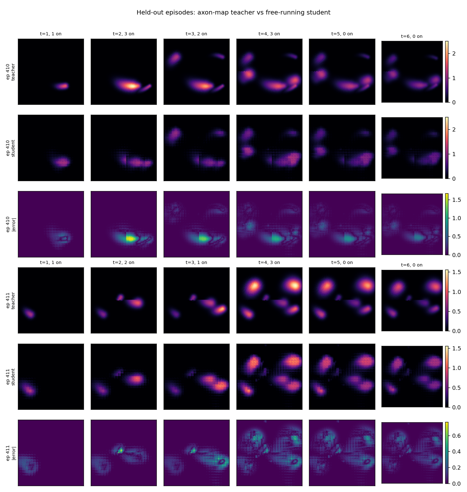
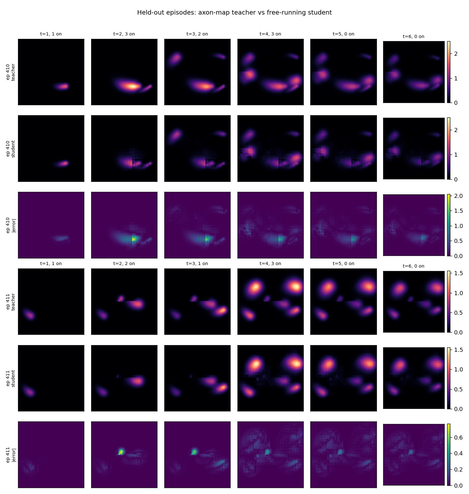
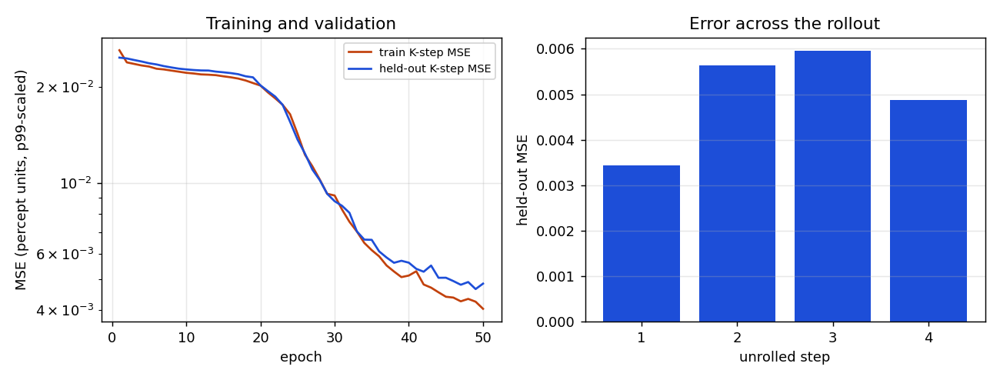
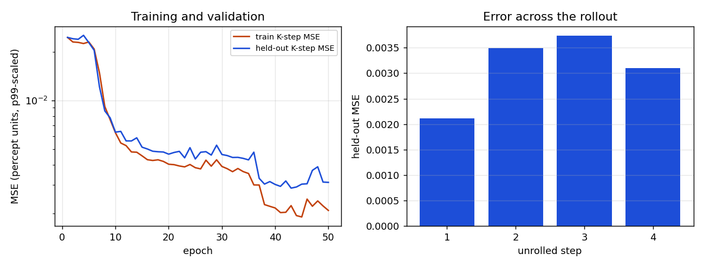

# From the axon map to a world model

[Home](../index.md) · [Getting started](../getting-started.md) · [Nomenclature](../nomenclature.md) · [Models](index.md) · [References](../references.md)

**Modality:** `brain2vision` · **Tissue:** retinal

This page continues the [axon map](axonmap.md). That page is the phenomenon:
streaks, pulse parameters, and the demo. This page is the Sentionaut
implementation of that model, what it costs on a CPU and on a GPU, and why we
then distill it into a world model.

## The model Sentionaut implements

`BiphasicAxonMapTorch` is the same calculation as pulse2percept's biphasic
axon map (Granley and Beyeler, 2021, on the axon paths of Beyeler et al.,
2019). Three pieces, in order.

1. **Where the axons are.** Once per grid, on the CPU, pulse2percept grows a
   Jansonius polyline through every pixel and we cache the raw points. For the
   Argus II grid used below, `(-12, 12)` dva at step 0.25, that tensor is
   `(9409 pixels, 74 samples, 2)`. It is about 5.6 MB. `rho` and `axlambda`
   are not baked into it, so they stay inputs.
2. **What one pulse does.** On the device you asked for, every active
   electrode contributes a Gaussian spread and a streak weight. The drive at
   a pixel is the max, along its axon, of the sum over electrodes. Amplitude
   is in units of threshold. Frequency and phase duration scale brightness,
   size, and streak length.
3. **How the light fades.** Brightness `B` is the whole state. One step of
   the leaky integrator, with `dt` 20 ms and `tau` 100 ms, is

   `B_next = B + dt * (drive - B) / tau`,

   and anything at or below the percept threshold becomes zero. This step
   does not look at the axon tensor.

```python
from sentionaut.core.config import Config
from sentionaut.core.registry import build_components

cfg = Config(model="axonmap", implant="argusii", xrange=(-12, 12), yrange=(-12, 12), xystep=0.25)
implant, topo, model = build_components(cfg)
drive = model.spatial_forward(action)
state = model.step(None, action)
```

The topography build is the part that needs pulse2percept and a cache
directory. After that, `spatial_forward` and `step` are ordinary tensor code.

## The check against pulse2percept

The parity test in `tests/test_parity.py` builds both implementations on the
CPU, in float32, on Argus II with electrodes C5 and E7 firing, grid
`(-8, 8)` at step 0.5 (33×33, 72 axon samples per pixel). The test fails if
the max absolute difference is `1e-3` or more.

Measured on the machine that ran this check: max absolute error
`5.96e-8`, mean absolute error `1.45e-9`. The torch port is the same
arithmetic as pulse2percept 0.9.0 at the precision of float32. The generous
threshold is there so a real regression still fails the test.

## The torch model on CPU and on GPU

Same call, three active electrodes at 1.5× threshold, 30 forwards after one
warmup. CPU is the machine that ran the parity check. GPU is a Quadro RTX
8000 on the Mila cluster. The axon cache was already warm.

| | 33×33 check grid | 97×97 distillation grid |
| --- | --- | --- |
| CPU `spatial_forward` | 1.68 ms | 13.3 ms |
| GPU `spatial_forward` | 0.91 ms | 1.22 ms |
| GPU peak memory |  | 56 MB |

On the small grid the axon tensor is cheap and the GPU is only a little
faster. On the 97×97 grid the reduction is about 11× faster on the GPU. The
topography itself stays on the CPU: a warm load of that grid was 0.35 s on
the CPU machine and 5.6 s on the cluster node, which is unpickling and moving
the tensor, not the pulse.

The teacher has no batch dimension. Eight patients are eight calls.

## Why a world model

The axon map is the right teacher. It is a poor thing to call a thousand
times. A world model, here, is a learned function with the same contract,
`f(B_t, stimulation_t) → B_{t+1}`, that you can ship without the teacher.

That is worth doing when the call site is a loop:

- a policy searching for a stimulation,
- a sweep of `rho` and `axlambda`,
- a demo on a laptop that does not have pulse2percept,
- a batch of patients who share an implant and a grid.

It is the wrong tool when the grid, the implant, or the axon paths are new.
Then you run the teacher, which is what generates the training data.

## Two students

Both students read electrode tokens `(x, y, amplitude, frequency, phase
duration)` and condition on `rho` and `axlambda`. They differ in what they
are willing to hard-code.

**The drive student** (`AxonMapWorld`) predicts only the spatial drive. The
fade equation above stays exact, outside the network. Error can only be in
the picture of the streak, not in the time constant. This is the checkpoint
we measured.

**The video student** (`AxonVideoWorld`, the Genie-style model) predicts the
next frame from a causal window of past frames and stimulations. Nothing
temporal is hard-coded, so the rise, the fade, and the threshold have to be
learned. The block is the Genie split (Bruce et al., 2024): attention across
patches inside one frame, then causal attention across time at each patch, so
the cost is `T·N² + N·T²` rather than attention over the whole video at once.
Two Genie pieces are left out on purpose. Genie invents latent actions
because game video has no labels; stimulation here is known, so it enters as
electrode tokens. Genie predicts discrete visual tokens; a phosphene field is
a smooth brightness, so the loss is mean squared error on the frame. During
training the context frames are noised a little, so a free-running rollout
survives its own mistakes. The network starts as "the frame stays put" and
has to learn the change, including the fade the drive student was given.

Use the drive student when you trust the ODE and want the smallest error on
the streak. Use the video student when the thing you want to learn is the
dynamics, or when a later teacher does not have a fade equation you can
write down. [The video world model page](axonmap-video.md#results) has its
measured results: the learned fade, free-running streams, and a matched
comparison against the drive student.

```python
from sentionaut.learned.axon_world import AxonMapWorld

student = AxonMapWorld.from_pretrained("ascientist/sentionaut-axon-world")
state = student.step(None, action)
```

`from_pretrained` downloads the checkpoint from the Hugging Face Hub into the
local cache and rebuilds the module from the weights. A directory that
already contains `axon_world.pt` works the same way, which is how a fine-tune
starts: load the published weights, then keep training on your own episodes.
The random-stimulation run is `ascientist/sentionaut-axon-world`. The MNIST
run, whose stimulation is read off the digit instead of drawn at random, is
`ascientist/sentionaut-axon-world-mnist`.

## How close the drive student is to the teacher

These figures are the CPU reproduction of the drive student on the 97×97
grid: 512 episodes, 4 stimulated steps and 2 silent steps, last 20% of
episodes held out. The student is free-running. It sees the first teacher
frame and then only its own prediction. Columns with no active electrode are
the analytical fade, which this student does not have to learn.



The default student (dim 64, depth 2, 106,704 parameters, 1.3 MB on disk)
puts the phosphene in the right place and fades it at the right rate. It
blurs the streak, undershoots the brightest pixel, and shows 4×4 blocking
from the patch decoder. The wide student (dim 128, depth 4, 814,224
parameters) recovers the streak direction and most of the peak:







Loss is mean squared error on the percept divided by the teacher's 99th
percentile (0.219). Held-out teacher frames reach 2.50 in those units.

| held-out metric | default | wide |
| --- | --- | --- |
| K-step MSE | 0.00497 | 0.00311 |
| RMSE | 0.0705 | 0.0558 |
| RMSE / teacher range | 2.8% | 2.2% |
| Pearson r vs teacher | 0.910 | 0.947 |
| mean peak-brightness shortfall | 0.285 | 0.103 |

Train and held-out curves overlap for the default student and are still
descending at epoch 50, so that run is limited by capacity and by the
schedule. The GPU training of the same default architecture, on a longer
episode (8 stimulated steps plus 2 silent) and the same 512 episodes and 50
epochs, ended at validation MSE 0.0046. Same model, same neighbourhood of
error.

Peak brightness is the weak spot. Mean squared error over a field that is
mostly zero does not pay much for the single brightest pixel.

## CPU and GPU, teacher against student

One forward of the spatial piece, 97×97, three electrodes. The drive student
is the published default checkpoint (dim 64, depth 2).

| | CPU | GPU (RTX 8000) |
| --- | --- | --- |
| teacher `spatial_forward` | 13.3 ms | 1.22 ms |
| student `spatial_drive`, one sample | 2.37 ms | 2.54 ms |
| student, batch of 8, per sample |  | 0.33 ms |

On a single GPU call the teacher is the faster of the two: the broadcast fits
and the transformer pays a launch cost. The student is the one that batches.
Eight sequential teacher calls are about 9.7 ms; one batched student call is
2.6 ms. On the CPU the student is already faster for a single call, 2.4 ms
against 13.3 ms, and it never loads the axon tensor or pulse2percept.

A separate CPU-only container (4 cores, 15 GB, no GPU) measured the teacher
at 15.6 ms and this student at 1.49 ms on one call, and 0.68 ms per sample at
batch 64. Same ordering, different machine. Details and the wide student are
in [`axon_world_report.json`](../assets/axon-world/axon_world_report.json).

## When the world model is the one you want

Call the teacher for a new grid, a new implant, or a number you will quote as
the physics. Call the student when the grid and the implant are the ones it
saw, and you will call `step` many times:

- interactive use on a CPU, where 2 ms and no topography build is the whole
  product,
- a batched search on a GPU, where the teacher cannot batch and the student
  can,
- a model trained on your own images. MNIST episodes paint the digit on the
  percept grid and set each Argus electrode from the brightness of its cell,
  then the axon-map teacher rolls the fade on the GPU. On an RTX 8000, eight
  epochs starting from the random-stimulation checkpoint stayed at held-out
  MSE 0.0057. The same eight epochs from scratch on that file went from
  0.0063 to 0.0036. For this dataset the MNIST weights are the from-scratch
  run, and the random-stimulation weights stay the general starting point
  you can keep training. The call is `from_pretrained`, then more epochs on
  your HDF5.

Source: `src/sentionaut/models/axonmap.py`,
`src/sentionaut/learned/axon_world.py`,
`src/sentionaut/learned/axon_video.py`.
