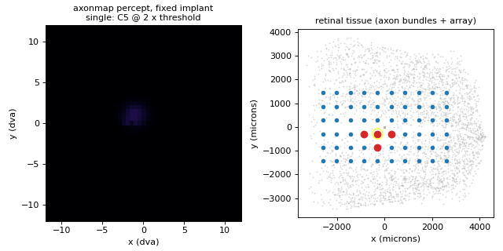
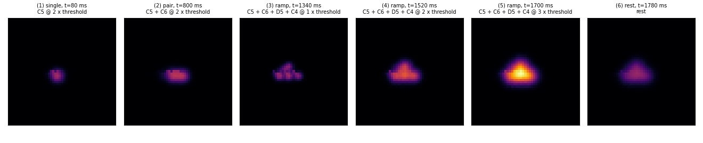
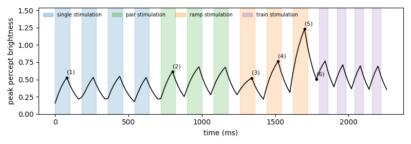

# Axon map

[Home](../index.md) · [Getting started](../getting-started.md) · [User guide](../user-guide.md) · [Nomenclature](../nomenclature.md) · [Models](index.md) · [References](../references.md)

**Modality:** `brain2vision` · **Tissue:** retinal

## Paper

Jacob Granley, Michael Beyeler.
*A computational model of phosphene appearance for epiretinal prostheses.*
IEEE EMBC 2021.
[doi:10.1109/EMBC46164.2021.9629663](https://doi.org/10.1109/EMBC46164.2021.9629663)

Spatial axon trajectories follow Beyeler et al. 2019
([doi:10.1038/s41598-019-45416-4](https://doi.org/10.1038/s41598-019-45416-4)).

## What it does

Predicts phosphene appearance for epiretinal implants by activating nerve-fiber
bundles (streaks) and scaling brightness, size, and streak length from biphasic
pulse amplitude, frequency, and phase duration. `Action.amp` is in units of
threshold (typically 0.5–3.0).

## Demo walkthrough

The Argus II array stays still while four neighbouring electrodes
(C5, C6, D5, C4) receive singles, pairs, an amplitude ramp and a pulse train.
If this is your first demo, read [how to read the demos](demos.md) first.



### What to look for



1. **One electrode gives a short streak, not a round dot.** Frame (1) is
   slightly stretched along the local nerve-fibre bundle. The model activates
   every axon that passes near the electrode, and each axon's contribution
   decays with its distance to the cell body:

    $$
    I(p) = \max_{q \in \text{axon}(p)} \sum_{e} F_\text{bright}\,
    \exp\!\Big(-\frac{d_e(q)^2}{2\rho^2 F_\text{size}}\Big)\,
    \exp\!\Big(-\frac{d_\text{soma}(q)^2}{2\lambda^2 F_\text{streak}}\Big)
    $$

    The first exponential is the spread around the electrode ($\rho$), the
    second is the spread along the axon ($\lambda$), which is what stretches
    the phosphene along the nerve-fibre bundle. With $\lambda = 500\,\mu m$
    the stretch is modest; a larger $\lambda$ gives longer streaks (the
    `make animate` clip sweeps $\lambda$ to show this).

2. **Two electrodes merge into one shape.** In frame (2) the two streaks
   overlap and add up (the $\sum_e$ above), giving one wider, brighter
   phosphene rather than two separate dots.

3. **More current mostly means bigger, not brighter.** Frames (3) to (5) show
   the ramp. With a 0.45 ms pulse at 30 Hz, the effect models give:

    | Amplitude | $F_\text{bright}$ | $F_\text{size}$ | effective $\rho$ |
    | --- | --- | --- | --- |
    | 1 × threshold | 0.64 | 0.72 | 170 µm |
    | 2 × threshold | 0.79 | 1.80 | 268 µm |
    | 3 × threshold | 0.94 | 2.88 | 339 µm |

    Size grows about 4× while $F_\text{bright}$ grows only about 1.5×. The peak
    in the timeline still rises from 0.52 to 1.23, because bigger phosphenes
    from the four electrodes overlap more and their sum is larger.
    $F_\text{streak}$ depends only on pulse duration, so the streak length
    stays the same across the ramp.

4. **The percept lingers.** Frame (6) is the last rest frame after the
   brightest pulse: the phosphene is dimmer but clearly still there.

### Over time



- Every pulse rises and every rest decays with the same 100 ms leaky
  integrator (see [fading](demos.md#4-one-idea-shared-by-axon-map-and-scoreboard-fading)).
  A 5-frame pulse gets to about 67% of its steady value, and a 4-frame rest
  keeps about 41%, so the curve never touches zero.
- In the pulse train the peaks drop from 0.77 to 0.69. This is **not**
  adaptation: the axon map has no memory. The first train pulse starts on top
  of the leftover light from the bright 3 × ramp; after that the curve settles
  into a repeating pattern.

Regenerate the clip and figures with `make demos`.

## Usage

```python
from sentionaut.core.config import Config
from sentionaut.core.registry import build_components

cfg = Config(model="axonmap", implant="argusii")
implant, topo, model = build_components(cfg)
```

Source: `src/sentionaut/models/axonmap.py`

A specialist student of this model, with the same `step` and the fade left
exact, is the [axon-map world model](axonmap-world.md).
