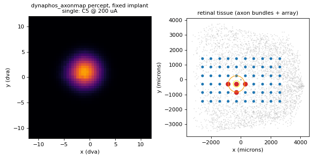
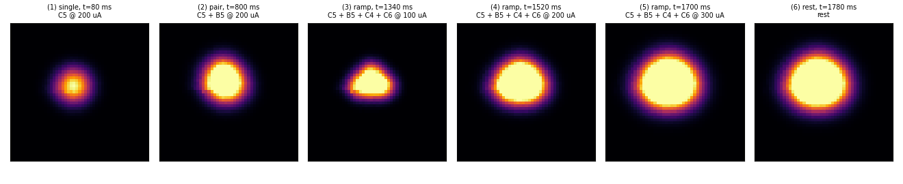
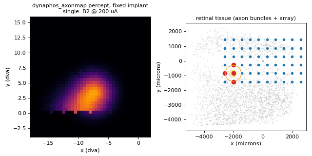
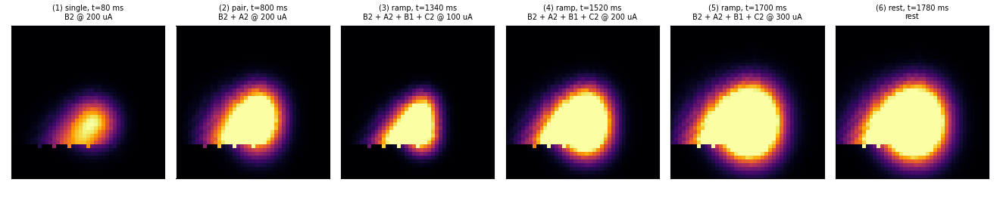
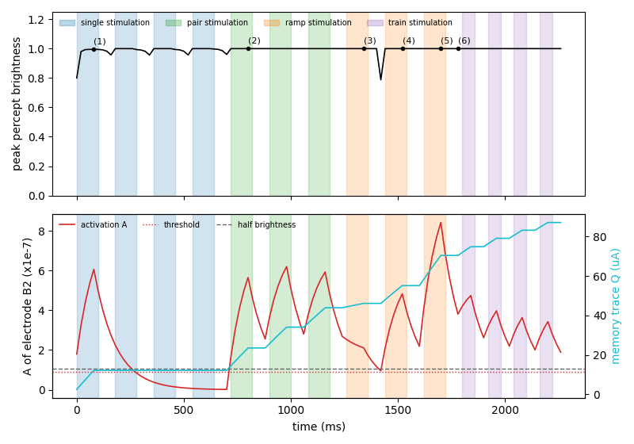
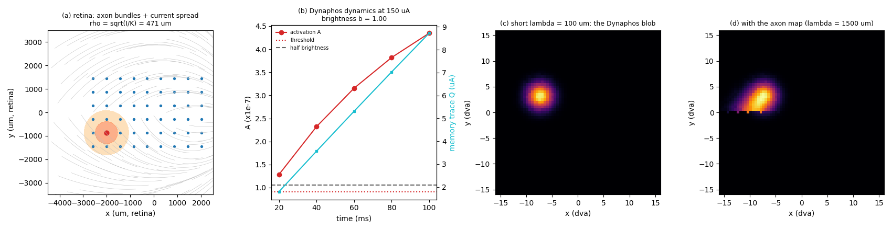
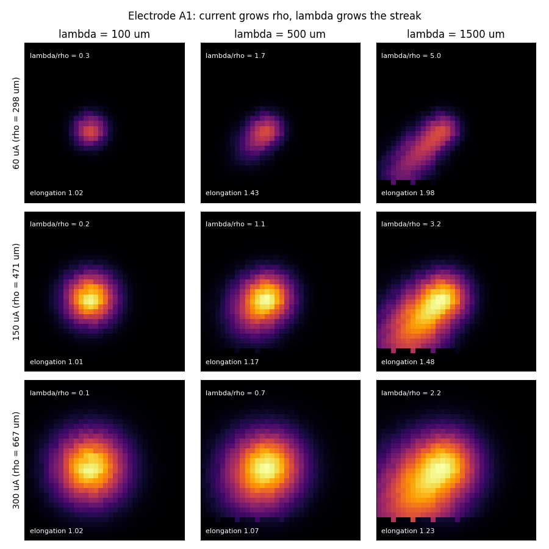
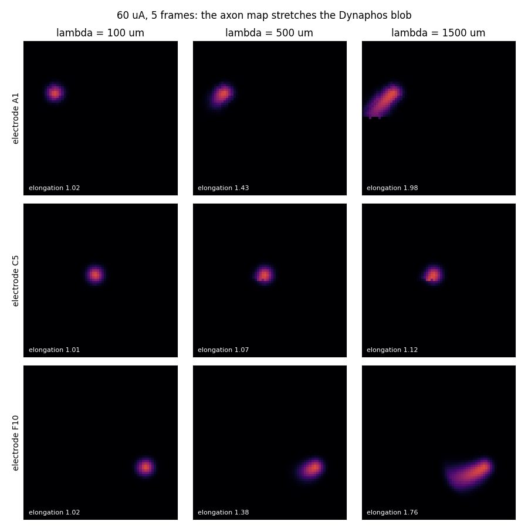
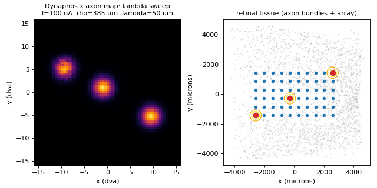
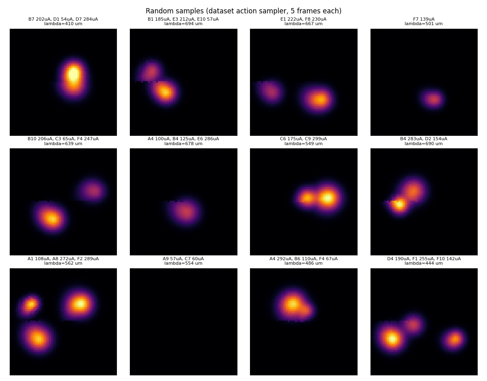

# Dynaphos × axon map

[Home](../index.md) · [Getting started](../getting-started.md) · [Nomenclature](../nomenclature.md) · [Models](index.md) · [References](../references.md)

**Modality:** `brain2vision` · **Tissue:** retinal (epiretinal)

Two backends with identical physics, both GPU-capable:

| ID | Class | Backend | GPU |
| --- | --- | --- | --- |
| `dynaphos_axonmap` | `DynaphosAxonMapTorch` | PyTorch | CUDA / MPS via `get_device` |
| `dynaphos_axonmap_jax` | `DynaphosAxonMapJax` | JAX (`jit`, `lax.scan`) | CUDA with `--extra jax-cuda` |

## Papers

Maureen van der Grinten, Jaap de Ruyter van Steveninck, Antonio Lozano, et al.
*Towards biologically plausible phosphene simulation for the differentiable
optimization of visual cortical prostheses.*
eLife 13, e85812 (2024).
[doi:10.7554/eLife.85812](https://doi.org/10.7554/eLife.85812)
Source of the temporal dynamics, brightness, threshold and current spread.

Michael Beyeler, Devyani Nanduri, James D. Weiland, Ariel Rokem, Geoffrey M. Boynton, Ione Fine.
*A model of ganglion axon pathways accounts for percepts elicited by retinal implants.*
Scientific Reports 9, 9199 (2019).
[doi:10.1038/s41598-019-45416-4](https://doi.org/10.1038/s41598-019-45416-4)
Source of the axon layout (Jansonius nerve-fibre bundles, as built by
pulse2percept).

## What it does

It is [Dynaphos](dynaphos.md) moved from the cortex to the retina. It keeps
the charge trace, the leaky activation, the steep sigmoid brightness, the
detection threshold and the current-dependent size. The phosphene is then
drawn through the [axon map](axonmap.md), so it follows the retinal
nerve-fibre bundles instead of being a round blob. `Action.amp` is in µA
(typically 50–300).

## Demo walkthrough

The Argus II array stays still while the same four central electrodes as the
[Axon map demo](axonmap.md#demo-walkthrough) (C5, B5, C4, C6) receive
singles, pairs, an amplitude ramp and a pulse train. Currents are in µA, as
on the cortical pages (200 µA, then a 100/200/300 µA ramp), and
$\lambda = 500\,\mu m$. If this is your first demo, read
[how to read the demos](demos.md) first. The orange circles in the tissue
panel show the current spread $\rho$ of each stimulated electrode.



### The model in five equations

For each electrode, every 20 ms frame, steps 1 to 3 are exactly Dynaphos:

1. **Effective current.** Only current above the rheobase $I_0 = 23.9$ µA
   counts, reduced by the memory trace $Q$, and scaled by the duty cycle
   (frequency $f$ times pulse width $pw$; defaults 300 Hz and 0.17 ms):

    $$ I_\text{eff} = \max\big(0,\ (I - I_0 - Q)\, f\, pw\big) $$

2. **Activation and memory trace.** $A$ integrates $I_\text{eff}$ and leaks
   with $\tau_\text{act} \approx 111$ ms. $Q$ integrates it and leaks with
   $\tau_\text{trace} \approx 33$ min, so within a clip it only goes up:

    $$ A \leftarrow A + \Big(-\frac{A}{\tau_\text{act}} + 10^{-6} I_\text{eff}\Big)\Delta t, \qquad
       Q \leftarrow Q + \Big(-\frac{Q}{\tau_\text{trace}} + \kappa\, I_\text{eff}\Big)\Delta t $$

3. **Brightness.** A steep sigmoid of $A$. The electrode is drawn only while
   $A \ge A_\text{thr}$:

    $$ b = \frac{1}{1 + e^{-k(A - A_{50})}} $$

Steps 4 and 5 are where the model differs from Dynaphos:

4. **Size: current spread in the retina.** Dynaphos spreads the current over
   a disc of diameter $D = 2\sqrt{I/K}$ (with $K = 675$ µA/mm²). On the
   cortex it divides by the magnification $M$ to get degrees. Here the
   Gaussian stays in retinal tissue, with standard deviation half that
   diameter:

    $$ \rho = \frac{D}{2} = \sqrt{I/K} \qquad (385,\ 544,\ 667\ \mu m \text{ at } 100,\ 200,\ 300\ \mu A) $$

5. **Shape: the axon map.** Every axon passing near the electrode is
   activated. Each pixel $p$ sees the strongest point $q$ along its own
   axon, weighted by the distance from $q$ back to the cell body:

    $$ I(p) = \min\Big(1,\ \max_{q \in \text{axon}(p)} \sum_{e:\,A_e \ge A_\text{thr}}
       b_e\, \exp\!\Big(-\frac{\lVert q - x_e\rVert^2}{2\rho_e^2}\Big)\,
       \exp\!\Big(-\frac{d_\text{soma}(q)^2}{2\lambda^2}\Big)\Big) $$

The first exponential is the current spread around the electrode (step 4).
The second is the axon sensitivity, which decays along the axon with length
constant $\lambda$ and is what stretches the phosphene into a streak.

### What to look for



1. **Near the fovea, a single electrode looks like Dynaphos.** In frame (1) the
   phosphene is round (elongation 1.03). Axons near the centre of the array
   are short, and $\rho = 544\,\mu m$ is already about as large as
   $\lambda = 500\,\mu m$, so the streak hides inside the blob. The
   [periphery demo](#demo-2-the-periphery-where-the-axons-show) below is
   where the streaks appear.
2. **Neighbours merge.** At 200 µA, $\rho$ (544 µm) is about the electrode
   pitch (575 µm), so the pair in frame (2) fuses into one shape. On the
   cortical pages the phosphene size is set by cortical magnification, and
   near the fovea it is a fraction of a degree. Here it is set by the
   spread in retinal tissue. Electrode C6 is still above threshold
   (A = 1.1 × $A_\text{thr}$) from its single pulse 180 ms earlier, so it
   adds to the shape.
3. **More current means bigger, not brighter.** Frames (3) to (5): the
   brightness is already at the ceiling, while the area above 10% grows
   270 → 472 → 669 pixels as $\rho$ grows with $\sqrt{I}$. The inverted-T
   outline in frame (3) is simply the layout of the four electrodes.
4. **The percept lingers.** Frame (6), 80 ms after the brightest pulse, is
   as large and as bright as during the pulse: $A$ is still 4 to 5 times
   the threshold.

### Over time: the hidden state


The temporal behaviour is identical to [Dynaphos](dynaphos.md#over-time-the-hidden-state),
because steps 1 to 3 are the same code. On electrode C5:

- **Rise and linger.** $A$ peaks at 6.6 × $A_\text{thr}$ and only drops below
  threshold at 280 ms, 180 ms after the first pulse ended.
- **Habituation.** $Q$ climbs from 12 µA after the first pulse to 87 µA at the
  end. Across the pulse train, the activation peaks fall from 5.2 to 3.7 ×
  $A_\text{thr}$.
- **Brightness saturates.** The peak-brightness curve (top) stays between
  0.79 and 1.0 for the whole clip. With several electrodes of $b \approx 1$
  overlapping, the sum reaches the ceiling of 1. The model's dynamics are in
  $A$ and $Q$, and in the size of the phosphene.

Regenerate the clip and figures with `make demos`.

## Demo 2: the periphery, where the axons show

Same schedule on a zone at the corner of the array (B2, A2, B1, C2), with
$\lambda = 1500\,\mu m$. The percept window is centred on that part of the
visual field.





- **A single electrode now gives a streak.** Frame (1) is elongated along
  the arcuate nerve-fibre bundle (elongation 1.34 vs 1.03 at the centre).
  The streak points away from the optic disc, toward the periphery.
- **The straight lower edge is the horizontal raphe.** Axons from the
  inferior and superior retina do not cross the horizontal meridian on the
  temporal side, so the streak stops at y = 0. This is anatomy, not
  clipping. The few bright specks on that edge are a discretisation artefact
  of the axon map (also present in pulse2percept).
- **Everything else matches the central demo.** The dynamics are the same
  per electrode (the timeline is identical to the one above), and the size
  grows with current in the same way.



## Anatomy of one phosphene

One electrode (B2) stimulated at 150 µA for five 20 ms frames, step by step:



- **(a) Retina.** Grey lines are nerve-fibre bundles, running toward the
  optic disc (off the right edge). The orange discs are the current spread,
  at $1\rho$ and $2\rho$ with $\rho = \sqrt{150/675}$ mm = 471 µm.
- **(b) Dynaphos dynamics.** At 150 µA, $A$ is past both the threshold and
  half brightness after the first frame, and the brightness saturates
  ($b = 1.00$ at 100 ms). $Q$ rises steadily.
- **(c) Short λ.** With $\lambda = 100\,\mu m$ only the part of each axon
  next to its cell body counts. The percept is the round Dynaphos blob,
  placed through the retina → visual-field transform.
- **(d) Long λ.** With $\lambda = 1500\,\mu m$, cells whose axons pass under
  the electrode also light up, and the blob grows a streak along the bundle.

Note that the retina (a) and the visual field (c, d) are mirrored
vertically. The eye's optics invert the image, so the inferior retina
(y < 0) sees the upper visual field (y > 0). The tissue panel of the demo
clips shows the same inversion.

## Streak length: λ against current



The elongation depends on the ratio $\lambda / \rho$, not on $\lambda$ alone.
A larger $\lambda$ lengthens the streak. A larger current raises
$\rho = \sqrt{I/K}$ and fattens the phosphene around it. At $\lambda = 1500$ µm
the elongation drops from 1.98 at 60 µA ($\lambda/\rho = 5$) to 1.23 at
300 µA ($\lambda/\rho = 2.2$). Under the Dynaphos current-spread
law, the model therefore predicts that strong stimulation gives rounder, not
longer, phosphenes. Patient drawings could test that prediction.

The same effect on three electrodes (corner A1, centre C5, corner F10) at
60 µA. The centre electrode barely streaks at any $\lambda$:



## Sweep animation



The clip plays three acts on electrodes A1, C5 and F10:

1. **λ sweep at 100 µA** (50 → 2000 µm): the blobs at the corners grow
   streaks, and the centre one stays round.
2. **Current sweep at λ = 1500 µm** (60 → 300 µA): $\rho$ grows (orange
   circles) and the streaks are absorbed into bigger blobs.
3. **One 150 µA pulse, then rest**: the phosphenes stay for 140 ms after
   the pulse while dimming to half brightness. At +160 ms $A$ falls below
   threshold and they vanish in a single frame (brightness 0.51 → 0), the
   on/off character of the Dynaphos threshold.

Acts 1 and 2 restart the model for every frame, so each frame shows a single
parameter value. Act 3 carries the state across frames. The MP4 is
`artifacts/dynaphos_axonmap.mp4` (`make animate MODEL=dynaphos_axonmap`).

## Random samples

What a world-model dataset of this model looks like: twelve actions drawn by
the dataset generator's sampler (`sentionaut-world`). Each draws 1 to 3
electrodes at 50–300 µA, 10–100 Hz, 0.1–0.5 ms and $\lambda$ = 400–700 µm,
held for five frames.



The sampled pulse trains are Argus-like: slower and shorter-duty than the
Dynaphos defaults (300 Hz, 0.17 ms). The effective current is therefore
smaller, and weak currents can stay below threshold. The A9 + C7 sample
(57 and 60 µA) produces no phosphene at all.

Regenerate the figures with `uv run python examples/dynaphos_axonmap_figures.py`
(included in `make demos`).

## Why the two models combine this way

Both papers use the same spatial primitive: a Gaussian of activated tissue
around the electrode. They only differ in the space where the Gaussian lives.

- **Dynaphos** (van der Grinten 2024, Eqs 5–6) has $D = 2\sqrt{I/K}$ mm,
  $P = D/M$ dva, and draws a Gaussian with $2\sigma = P$. In tissue that is
  a standard deviation of $D/2 = \sqrt{I/K}$; the cortical magnification $M$
  only converts mm of cortex to degrees.
- **Axon map** (Beyeler 2019, Eq 9) keeps the Gaussian in retinal µm and
  weights each axon segment by $\exp(-d_\text{soma}^2 / 2\lambda^2)$. The
  axon topography maps the retina to the visual field.

So the hybrid keeps Dynaphos Eqs 7–13 unchanged. It replaces "divide by $M$,
then draw an isotropic Gaussian in dva" with the axon-map kernel, using the
Dynaphos current spread as the per-electrode $\rho$. As in Dynaphos, size
uses only the instantaneous current (not $Q$), and an electrode that stops
keeps its last size while $A$ decays.

**The default $K$ is plausible for retina.** $K = 675$ µA/mm² is the cortical
estimate (Tehovnik et al. 2006) used by Dynaphos. It gives
$\rho \approx 270$–$670$ µm for 50–300 µA, the same order as the per-patient
$\rho$ fitted for Argus II in Beyeler 2019 (144–437 µm). There is no retinal
fit of $K$ yet. Treat it as a parameter (`params["excitability"]`).

### Checks in the test suite

- $A$ and $Q$ follow Dynaphos Eqs 7–13 exactly, frame by frame.
- $\rho_e = 1000\sqrt{I/K}$ µm.
- With $F_\text{size}=F_\text{streak}=1$ and $F_\text{bright}=b$, the render
  equals the pulse2percept-parity-tested `BiphasicAxonMapTorch` kernel.
- As $\lambda \to 0$ it reduces to an isotropic Dynaphos Gaussian at each
  pixel's retinal location.
- Off-fovea, a larger $\lambda$ elongates the phosphene (≈1.0 → >1.4), and
  it never removes light.
- JAX matches torch to ~1e-5 over multi-frame sequences with pose and
  co-stimulation. `lax.scan` rollouts match step-by-step loops. `jax.grad`
  and `jax.vmap` work.

## Usage

PyTorch (differentiable end to end with torch autograd):

```python
import torch
from sentionaut.core.base import Action
from sentionaut.core.config import Config
from sentionaut.core.registry import build_components

cfg = Config(model="dynaphos_axonmap", implant="argusii", axlambda=1000.0)
implant, topo, model = build_components(cfg)          # CUDA / MPS if available
amp = torch.zeros(implant.n_electrodes)
amp[implant.names.index("C5")] = 150.0                # uA
state = None
for _ in range(5):
    state = model.step(state, Action(amp=amp.to(topo.coords.device)))
state.image            # (H, W) percept
state.aux              # per-electrode A, Q, sigma (= rho_e, microns)
```

JAX through the same framework interface (`uv sync --extra jax`, add
`--extra jax-cuda` for NVIDIA GPUs):

```python
cfg = Config(model="dynaphos_axonmap_jax", implant="argusii")
implant, topo, model = build_components(cfg)
frames = model.predict_sequence(Action(amp=amp), n_steps=10)   # one fused lax.scan
```

Pure functional JAX core, for `jax.grad` / `jax.vmap` / custom loops:

```python
import jax, jax.numpy as jnp
from sentionaut.models import dynaphos_axonmap_jax as dj

p, geom, shape = model.params, model.geom, topo.grid_shape
n = implant.n_electrodes
elec_xy = jnp.asarray(implant.electrode_coords().cpu().numpy())
amps = jnp.zeros((10, n)).at[:, 24].set(150.0)                 # (T, E) stimulation plan
state, frames = dj.rollout(p, geom, dj.init_state(n), amps,
                           jnp.full((10, n), p.freq), jnp.full((10, n), p.p_dur),
                           elec_xy, 500.0, grid_shape=shape)
```

Notes:

- Epiretinal implants only (PRIMA is rejected, as for the axon map).
- `Action.axlambda` overrides λ per call. `Action.rho` is ignored because
  ρ follows from the current.
- The torch ↔ JAX adapter copies tensors via DLPack (zero-copy on a shared
  CUDA device). Torch autograd does not cross it, so differentiate the JAX
  core with `jax.grad` instead.
- In the learned world model both backends share one model id.

Sources: `src/sentionaut/models/dynaphos_axonmap.py`,
`src/sentionaut/models/dynaphos_axonmap_jax.py`,
`examples/dynaphos_axonmap_figures.py`
