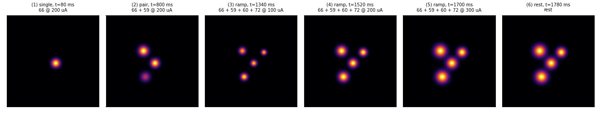
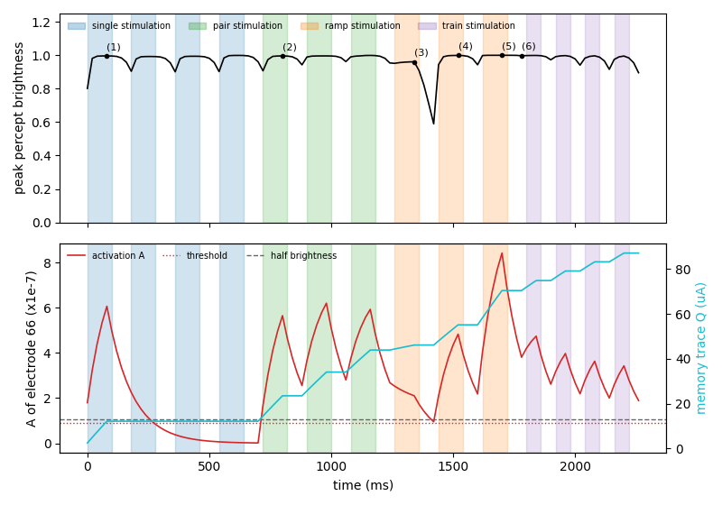

# Dynaphos

[Home](../index.md) · [Getting started](../getting-started.md) · [User guide](../user-guide.md) · [Nomenclature](../nomenclature.md) · [Models](index.md) · [References](../references.md)

**Modality:** `brain2vision` · **Tissue:** cortical

## Paper

Maureen van der Grinten, Jaap de Ruyter van Steveninck, Antonio Lozano, et al.
*Towards biologically plausible phosphene simulation for the differentiable
optimization of visual cortical prostheses.*
eLife 13, e85812 (2024).
[doi:10.7554/eLife.85812](https://doi.org/10.7554/eLife.85812)

Visuotopic map from Polimeni et al. 2006
([doi:10.1016/j.visres.2006.03.006](https://doi.org/10.1016/j.visres.2006.03.006)).

## What it does

Spatiotemporal cortical phosphene model with per-electrode charge and
activation traces. Predicts brightness that builds and fades over time;
optional co-stimulation leak between nearby electrodes. `Action.amp` is in µA
(typically 50–300).

## Demo walkthrough

Same fixed Orion zone (electrodes 66, 59, 60, 72) and same sequence as the
[Scoreboard demo](scoreboard.md#demo-walkthrough). If this is your first demo,
read [how to read the demos](demos.md) first. The percept panel is zoomed on
the zone for the same reason as on the Scoreboard page: near the fovea,
cortical magnification makes each phosphene a fraction of a degree wide.


### The model in four equations

For each electrode, every 20 ms frame:

1. **Effective current.** Only current above the rheobase $I_0 = 23.9$ µA
   counts, reduced by the memory trace $Q$, and scaled by the duty cycle
   (frequency $f = 300$ Hz times pulse width $pw = 0.17$ ms):

    $$ I_\text{eff} = \max\big(0,\ (I - I_0 - Q)\, f\, pw\big) $$

2. **Activation** $A$ integrates the effective current and leaks with
   $\tau_\text{act} \approx 111$ ms. A phosphene is drawn only while
   $A$ is above the threshold $A_\text{thr}$:

    $$ A \leftarrow A + \Big(-\frac{A}{\tau_\text{act}} + 10^{-6}\, I_\text{eff}\Big)\Delta t $$

3. **Memory trace** $Q$ grows with every pulse and leaks with
   $\tau_\text{trace} \approx 33$ minutes, so within the clip it only goes up:

    $$ Q \leftarrow Q + \Big(-\frac{Q}{\tau_\text{trace}} + \kappa\, I_\text{eff}\Big)\Delta t $$

4. **Appearance.** Brightness is a steep sigmoid of $A$, and size comes from
   the current and the local cortical magnification $M$ (mm of cortex per
   degree):

    $$ \text{brightness} = \sigma\big(k\,(A - A_{50})\big), \qquad
       P = \frac{2\sqrt{I/K}}{M} $$

### What to look for



1. **Small, sharp phosphenes that are either on or off.** The sigmoid is so
   steep that once $A$ is above threshold the brightness is almost 1. This is
   why frames (1) to (6) all look equally bright, and why the top panel of the
   timeline below is nearly flat.
2. **Phosphenes outlive the pulse.** In frame (2) a third phosphene is still
   visible from the previous single pulse, and in frame (6) the whole zone is
   still lit during the rest.
3. **More current means bigger phosphenes.** Frames (3) to (5): size grows
   with $\sqrt{I}$, so going from 100 to 300 µA makes each phosphene about
   1.7× wider.

### Over time: the hidden state



The top panel (peak brightness) saturates, so the interesting part is the
bottom panel: activation $A$ (red) and memory trace $Q$ (cyan) of the centre
electrode 66.

- **Rise and linger.** During the first pulse $A$ climbs to about 6.6 times
  the threshold. After the pulse stops it decays, but only drops below
  threshold at 280 ms, about 180 ms after the pulse ended. That is the
  lingering phosphene.
- **Silence while electrode 66 is off.** During the other three singles $A$
  keeps decaying toward zero and $Q$ stays flat: the trace only grows when
  this electrode is stimulated.
- **Habituation is real here.** $Q$ climbs step by step, from 12 µA after the
  first pulse to 87 µA at the end. Since $Q$ is subtracted from the current,
  the same 200 µA gives less and less effective current: across the pulse
  train the activation peaks fall from 4.75 to 3.43 (× 10⁻⁷). Unlike the
  [Axon map](axonmap.md#demo-walkthrough) and
  [Scoreboard](scoreboard.md#demo-walkthrough), this weakening would not go
  away with longer rests on the time scale of the clip.
- **Weak currents can fail.** At the 100 µA ramp step, $Q$ is already about
  46 µA, leaving little effective current: $A$ keeps falling during the pulse,
  and the peak brightness dips to about 0.58 in the rest that follows.

Regenerate the clip and figures with `make demos`.

## Usage

```python
from sentionaut.core.config import Config
from sentionaut.core.registry import build_components

cfg = Config(model="dynaphos", implant="orion")
implant, topo, model = build_components(cfg)
```

Source: `src/sentionaut/models/dynaphos.py`
