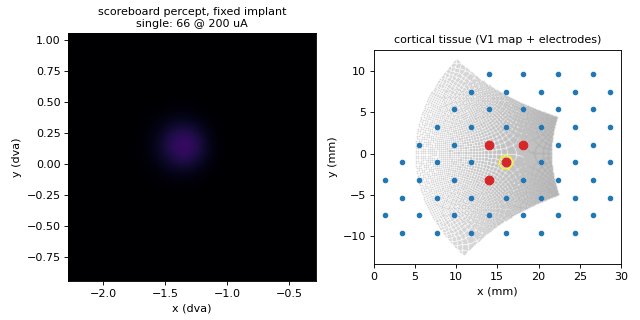
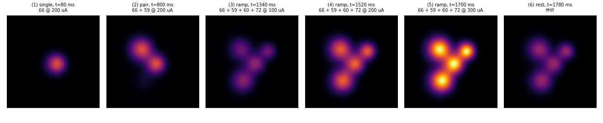
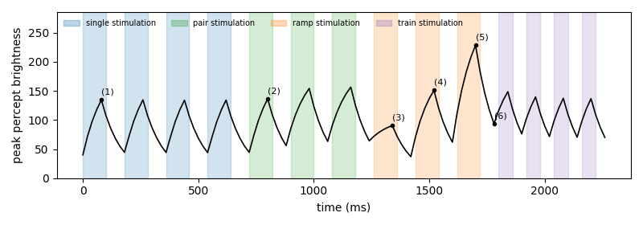

# Scoreboard

[Home](../index.md) · [Getting started](../getting-started.md) · [Nomenclature](../nomenclature.md) · [Models](index.md) · [References](../references.md)

**Modality:** `brain2vision` · **Tissue:** cortical

## Paper

Michael Beyeler, Devyani Nanduri, James D. Weiland, Ariel Rokem, Geoffrey M. Boynton, Ione Fine.
*A model of ganglion axon pathways accounts for percepts elicited by retinal implants.*
Scientific Reports 9, 9199 (2019).
[doi:10.1038/s41598-019-45416-4](https://doi.org/10.1038/s41598-019-45416-4)

Cortical electrode ↔ visual-field mapping uses Polimeni et al. 2006
([doi:10.1016/j.visres.2006.03.006](https://doi.org/10.1016/j.visres.2006.03.006)).

## What it does

Places a Gaussian blob at each active cortical electrode's visual-field
location (the "scoreboard" baseline: no axon streaks). Cortical magnification
makes peripheral phosphenes larger. `Action.amp` is in µA (typically 50–300).

## Demo walkthrough

The Orion array stays still while four neighbouring electrodes
(66, 59, 60, 72) receive singles, pairs, an amplitude ramp and a pulse train.
If this is your first demo, read [how to read the demos](demos.md) first.



**Why the percept panel is zoomed.** This zone maps to about 1.4° from the
centre of gaze. Near the fovea, a millimetre of cortex covers only a small
patch of the visual field (cortical magnification), so each phosphene is a
fraction of a degree wide. The panel shows a 2° × 2° window centred on the
zone instead of the full field.

### What to look for



1. **One electrode gives a round blob.** Frame (1). The Scoreboard places a
   Gaussian on the cortex around each active electrode and maps it back to the
   visual field:

    $$
    I(p) = \sum_{e} I_e \exp\!\Big(-\frac{\lVert c(p) - c_e \rVert^2}{2\rho^2}\Big)
    $$

    where $c(p)$ is the cortical location of pixel $p$, $c_e$ the electrode
    position and $I_e$ its current. There are no axons in cortex, so no
    streaks.

2. **Neighbours stay separate.** In frame (2) the two blobs touch but remain
   two phosphenes; the faint third blob is what is left of the previous
   single pulse on electrode 72.

3. **More current means brighter, not bigger.** Frames (3) to (5): the blobs
   keep the same size because $\rho$ is fixed, and only the brightness rises
   (peak 90 → 151 → 228 for 100, 200, 300 µA). The steps are not exactly
   1 : 2 : 3 because a 5-frame pulse has not reached its steady value yet, and
   each step starts from a different leftover.

4. **The percept lingers.** Frame (6), after the brightest pulse, is dimmer
   but still visible.

### Over time



- Same 100 ms leaky integrator as the axon map (see
  [fading](demos.md#4-one-idea-shared-by-axon-map-and-scoreboard-fading)):
  about 67% of the steady value after a pulse, about 41% left after a rest.
- The four singles reach the same peak (about 134): with no memory, the same
  input from the same starting point gives the same output.
- The small drop across the pulse train (149 → 137) is leftover light from
  the 300 µA ramp draining away, not adaptation. Compare with
  [Dynaphos](dynaphos.md#demo-walkthrough), where the weakening is real.

Regenerate the clip and figures with `make demos`.

## Usage

```python
from sentionaut.core.config import Config
from sentionaut.core.registry import build_components

cfg = Config(model="scoreboard", implant="orion")
implant, topo, model = build_components(cfg)
```

Source: `src/sentionaut/models/scoreboard.py`
