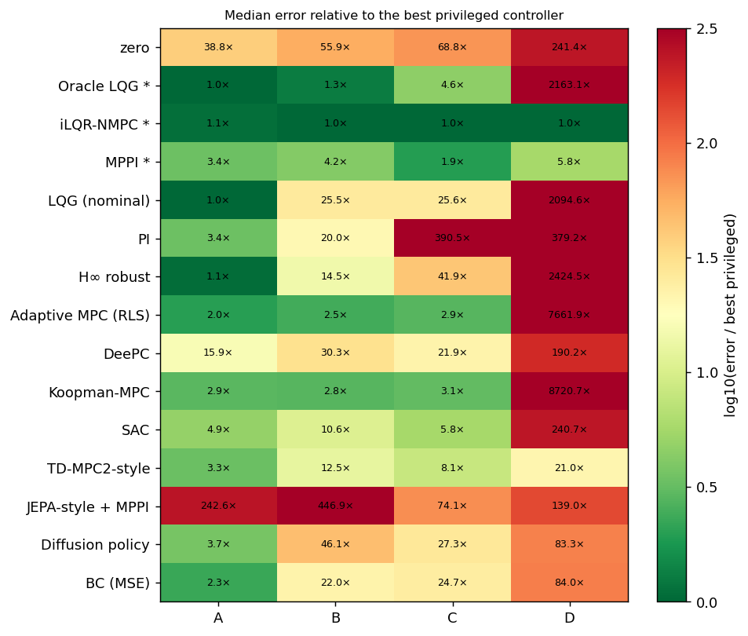
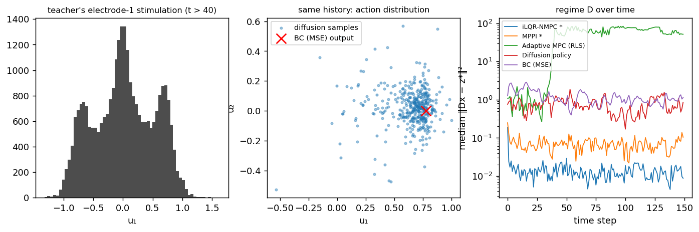

# Baselines on the canonical problem

[Home](index.md) · [Getting started](getting-started.md) · [Nomenclature](nomenclature.md) · [Models](models/index.md) · [NeuroStim](neurostim.md) · [References](references.md)

This page runs a suite of control baselines on the
[canonical formulation](neurostim-formulation.md): a population of random,
drifting, partially observed dynamical systems. The suite is built around
**orthogonal assumptions, not algorithmic novelty**. Each baseline answers
one question:

- What if the system is linear and known?
- Unknown, but identifiable online?
- Drifting?
- Uncertain within a set?
- Nonlinear but known?
- Learnable from data?
- Multimodal in its actions?

Source: `src/sentionaut/neurostim/canonical_control.py` (classical and
data-driven), `canonical_learned.py` (learned) · Tutorial:
`examples/neurostim_baselines_tutorial.py`

## 1. The "ARIMA test": four regimes

A new method should earn its place in order. In each regime, a class of
methods *should* win or tie. If a sophisticated method loses there, the
problem is the method.

| Regime | Dynamics | Patients | Observation | Who should win |
| --- | --- | --- | --- | --- |
| **A** LTI + Gaussian | $x' = Ax + Bu + w$ | one, known | $o = x + v$ | LQG (it is optimal) |
| **B** unknown LTI | same | $\theta \sim P_\Theta$, unknown | $o = x + v$ | online identification (adaptive MPC) |
| **C** smooth nonlinear + drift | $x' = A\,s(x) + B_t \tanh(u) + w$, with $B_t = B_\theta + \phi_t$ | random | $o = x + v$ | NMPC, Koopman, MPPI |
| **D** multimodal, partial | $x' = A\,s(x) + B\,(u^{2} - \tfrac14) + w$ | random | $o = Dx + v$ | where learned / generative methods get their chance |

$s(x) = \tanh(x)$ is firing-rate saturation. In D, recruitment is
**polarity-insensitive**, $g(u) = g(-u)$, as for charge-balanced biphasic
pulses. Each electrode therefore has two equally good settings $\pm u$, and
there are $2^m = 16$ equivalent optimal stimulation patterns. Averaging
two of them gives $u \approx 0$, which is *never* optimal. That is the
defining property of a multimodal control problem.

All methods see the same 20 held-out patients, the same targets from the
common set, and the same noise draws. Methods marked `*` read the true state
and model: they measure how hard *control* is, with learning removed.

## 2. The methods, one question each

| Method | Question it answers | Knows | Core idea |
| --- | --- | --- | --- |
| **Oracle LQG \*** | ceiling for linear-Gaussian | true $A, B_t$, state | Kalman filter + infinite-horizon LQR (separation principle) |
| **iLQR-NMPC \*** | how hard is control if the nonlinear model is known? | true model and state | receding-horizon iterative LQR, horizon 30 |
| **MPPI \*** | does gradient-free sampling handle what gradients cannot? | true model and state | sample plans, weight by $e^{-J/\lambda}$, average |
| **LQG (nominal)** | classical stochastic control, one design for everybody | the mean patient $(\bar A, \bar B)$ | LQG on the population mean |
| **PI** | the minimal feedback controller | the mean steady-state gain | $u = G^{+}(K_p e + K_i \textstyle\sum e)$, anti-windup |
| **H∞ robust** | can one robust controller cover the population? | the mean patient | minimax gain treating $(B - \bar B)u$ as a disturbance |
| **Adaptive MPC** | identify the individual online | nothing | RLS with forgetting on an ARX model, then certainty-equivalent LQ |
| **DeePC** | control straight from data, no model | nothing | Hankel matrices of the patient's own recent $(u, y)$ |
| **Koopman-MPC** | a lifting that makes nonlinear dynamics linear | nothing | EDMD: RLS on $\psi(o) = [o, o^3, \text{RFF}(o)]$, then LQ |
| **SAC** | model-free RL: is a model needed at all? | training patients | off-policy max-entropy actor-critic |
| **TD-MPC2-style** | latent model-based RL | training patients | latent dynamics + reward + Q, MPPI in latent space |
| **JEPA-style + MPPI** | does a predictive (non-reconstructive) representation support control? | training patients | predict future *embeddings*; linear probe for the percept; MPPI |
| **Diffusion policy** | does modelling the whole action distribution matter? | teacher demonstrations | DDPM over 8-step action chunks $p(u_{t:t+8} \mid \text{history}, z^\star)$ |
| **BC (MSE)** | control for the previous row: same data, a unimodal loss | teacher demonstrations | regression of the same action chunks |

The learned methods get the same input: the last 8 pairs $(o_t, u_{t-1})$
and the target $z^\star$. They are trained on patients disjoint from the
evaluation patients. The demonstrations come from a batched MPPI teacher
that knows the true model: the diffusion policy and BC imitate a privileged
expert (asymmetric imitation). Each learned method is a compact
implementation of its core idea, sized for a 6-D system, not the reference
code.

### What each method assumes

| Method | Unknown patient | Drift | Nonlinear | Partial obs. | Multimodal actions | Uncertainty |
| --- | --- | --- | --- | --- | --- | --- |
| LQG | ✗ | ✗ | ✗ | ✓ | ✗ | Gaussian |
| iLQR-NMPC | ✗ | ✗ (given $B_t$) | ✓ | ✗ (true state) | local | ✗ |
| MPPI | ✗ | ✗ (given $B_t$) | ✓ | ✗ (true state) | ✓ | sampling |
| H∞ | set | set | ✗ | ✓ | ✗ | worst case |
| Adaptive MPC | ✓ | ✓ (forgetting) | ✗ | ✓ (ARX lags) | ✗ | point estimate |
| DeePC | ✓ | ✓ (window) | ✗ | ✓ | ✗ | ✗ |
| Koopman-MPC | ✓ | ✓ (forgetting) | dynamics only | ✓ | ✗ | ✗ |
| SAC | implicit | implicit | ✓ | history | ◐ | ✗ |
| TD-MPC2-style | implicit | implicit | ✓ | history | ◐ | learned |
| JEPA-style | implicit | implicit | ✓ | history | planner | ✗ |
| Diffusion policy | implicit | implicit | ✓ | history | ✓ | generative |

## 3. Results

Median steady-state percept error $\lVert Dx - z^\star\rVert^2$ over the
second half of each 150-step episode, 20 held-out patients per regime. The
parentheses give the failure rate: the share of episodes that end worse than
not stimulating at all (same patient, target and noise). **Bold** marks
results within 10 % of the best method in that column, privileged ones
included.

| method | family | regime A | regime B | regime C | regime D |
| --- | --- | ---: | ---: | ---: | ---: |
| zero | reference | 0.575 | 0.574 | 0.591 | 2.728 |
| Oracle LQG * | ceiling | **0.015** | 0.013 | 0.039 | 24.444 (60% fail) |
| iLQR-NMPC * | ceiling | 0.017 | **0.010** | **0.009** | **0.011** |
| MPPI * | sampling | 0.051 | 0.043 | 0.017 | 0.065 |
| LQG (nominal) | classical | **0.015** | 0.262 (40% fail) | 0.220 (25% fail) | 23.670 (70% fail) |
| PI | classical | 0.050 | 0.205 (40% fail) | 3.357 (90% fail) | 4.285 (60% fail) |
| H∞ robust | robust | **0.016** | 0.149 (30% fail) | 0.360 (45% fail) | 27.399 (75% fail) |
| Adaptive MPC (RLS) | adaptive | 0.030 (5% fail) | 0.025 | 0.025 | 86.585 (85% fail) |
| DeePC | data-driven | 0.236 (5% fail) | 0.311 (30% fail) | 0.189 | 2.149 (40% fail) |
| Koopman-MPC | learned dynamics | 0.043 (5% fail) | 0.029 (10% fail) | 0.027 | 98.550 (95% fail) |
| SAC | model-free RL | 0.073 | 0.109 (5% fail) | 0.050 | 2.720 (10% fail) |
| TD-MPC2-style | model-based RL | 0.050 | 0.128 (10% fail) | 0.070 | 0.237 (5% fail) |
| JEPA-style + MPPI † | representation | 3.597 (100% fail) | 4.591 (100% fail) | 0.637 (55% fail) | 1.571 (30% fail) |
| Diffusion policy | generative | 0.055 | 0.473 (40% fail) | 0.234 (20% fail) | 0.942 |
| BC (MSE) | imitation (control) | 0.034 | 0.226 (35% fail) | 0.213 (15% fail) | 0.949 |



### Verdicts, regime by regime

**A. LTI + Gaussian: LQG should win or tie. ✔**
- **Oracle and nominal LQG tie** at 0.0148. With one known patient they are the same controller, and theory says it is optimal. H∞ (1.1×) and iLQR (1.1×) are indistinguishable from it.
- **Every learned method is 2.3–4.9× worse** (BC 0.034, TD-MPC2-style 0.050, diffusion 0.055, SAC 0.073). By the ARIMA criterion ("a learned method that cannot recover LQG in the LQG regime has a problem") they fail mildly: they have to rediscover from samples what a Riccati equation gives exactly.
- **JEPA fails outright** (see section 5). † This row predates the fixed
  read-out and regularisation. With the MLP probe, regime A improves to a
  median of 1.2, which still fails because of the planner. It will be
  re-run on the cluster.

**B. Unknown linear patient: online identification should be hard to beat. ✔**
- **Adaptive MPC is the best method without privileged knowledge** (0.025, 2.5× the ceiling), with Koopman close behind (0.029).
- **Every learned method is 4–19× worse than adaptive MPC.** A policy trained across patients must identify each one implicitly from an 8-step history, which it does far worse than recursive least squares.
- **One robust controller cannot cover this population.** H∞ is 6× worse than adaptive MPC and fails on 30 % of patients, and nominal LQG fails on 40 %. The answer to "do we need personalisation?" is yes.

**C. Smooth nonlinear + drift: NMPC / Koopman / MPPI. ✔ with a twist**
- **The model-based ceilings win:** iLQR at 0.009, MPPI at 1.9×.
- **Adaptive MPC and Koopman tie** (2.9× and 3.1×). The lifting buys nothing over a plain ARX model, because saturating recruitment stays nearly linear in the operating range, and both follow the drift through forgetting.
- **SAC is the best learned method** (5.8×).

**D. Partial observation + heterogeneity + multimodality: the learned methods' chance. ◐**
- **Every linear-model method collapses**, ending worse than no stimulation on 60–95 % of patients. Their linearisation of polarity-insensitive recruitment has zero or the wrong gain.
- **The privileged optimisers still succeed** (iLQR 0.011, MPPI 5.8×). The random initial plan keeps iLQR off the $u = 0$ saddle.
- **The best method without privileged knowledge is TD-MPC2-style** (21×, 5 % failures). This is the only regime where a learned method comes first, and it still leaves a 21× gap to the ceiling.
- **Diffusion (84×) and BC (84×) are indistinguishable**, and SAC is no better than no stimulation. Multimodality turned out not to be the bottleneck; section 4 shows why.

**Bottom line.**
- **Where classical methods dominate:** from A to C, classical adaptive stochastic control dominates, and learned methods pay a 2–20× sample-efficiency tax.
- **Where learned methods add value:** only in D, where no linear model is adequate. There, a latent model-based agent is the only non-privileged method that works.
- **What the large gaps measure:** implicit patient identification. That is what the learned methods are missing, and where a better method would contribute.

## 4. Multimodality, concretely

Regime D is multimodal by construction: every electrode has two equally good
settings $\pm u$. The teacher's actions show it. Across episodes, electrode
1's stimulation has modes at about −0.7, 0 and +0.7 (left).

**But the policy never has to represent that marginal.** Its input contains
the last 8 actions. After the first few steps of an episode, the sign pattern
is already committed, and the *conditional* distribution
$p(u_t \mid \text{history}, z^\star)$ is unimodal. The diffusion samples for
one held-out history form a single cluster around $u_1 \approx 0.7$, and
BC's regression output sits right in it (middle). So diffusion and BC
perform identically (right, and the table). What separates the learned
methods from the privileged optimisers is identifying the patient, not
choosing a mode.

To make multimodality matter, the benchmark must break this: for example,
condition only on the current observation (no action history), or change
the target mid-episode so that the committed mode becomes suboptimal. As it
stands, "generative control is needed for multimodal stimulation" is *not*
supported by this simulator. That is a useful negative result for the
hypothesis.



## 5. What building the baselines taught us

Every one of these came from a baseline that first looked broken. Each is a
property of the method, not a bug:

- **LQR gain and saturation.** A small control penalty ($\lambda = 0.01$)
  gives gains so aggressive that the actuator limit is hit during
  transients and the loop chatters: one target ended 2 500× worse than the
  rest. $\lambda = 0.1$ fixes it. Unconstrained optimality does not survive
  constraints.
- **H∞ near its limit.** Iterating the game Riccati equation close to the
  smallest feasible $\gamma$ can converge to a *non-stabilising* solution
  (closed-loop spectral radius 1.18). Feasibility must include a stability
  check. The suite uses $1.5\,\gamma_{\min}$.
- **Finite horizons hide slow modes.** MPPI with a 15-step horizon let 10
  units of state build up in directions the percept had not seen yet. A
  terminal cost equal to the LQR cost-to-go fixed it. iLQR needed a 30-step
  horizon to match LQG. This is the classic reason MPC uses terminal costs.
- **Sampling random-walks in flat directions.** With 4 electrodes for a 3-D
  percept there is a null direction. MPPI's weighted average drifts along
  it unless the plan is low-dimensional (3 knots) and anchored by the
  terminal cost.
- **DeePC alignment.** The Hankel data must pair $u_k$ with the output it
  causes, $y_{k+1}$. Off by one, DeePC silently fits the wrong system.
- **DeePC is data-hungry.** With a sliding window, closed-loop data soon
  dominate the Hankel matrix. They barely excite the system, so it loses
  rank: tracking degrades from 0.001 to 0.04 even without noise. Classic
  DeePC (the probe data only, 80 samples, $\lambda_g = 1$) removes the
  failures. Its error stays 8–16× that of RLS, because a deep Hankel matrix
  needs about $(m+1)(L+n)$ samples, most of a 150-step episode.
- **JEPA shortcut.** When the encoder sees past *actions*, a latent that
  just copies the action history is perfectly predictable from the next
  action. The JEPA loss is then satisfied without modelling the brain at
  all. The fix is to encode observations only and feed actions to the
  predictor.
- **JEPA does not collapse; its read-out and its planner were the problem.**
  - *Regularisation.* VICReg (25 / 25 / 1) is now applied to every embedding
    the loss touches: the encoder output at each timestep, the prediction
    targets included, and every predictor output.
  - *Collapse is detectable, and prevented.* End of training, regime A:

    | Variant | Effective rank / 16 | Per-dim std | Non-Gaussianity | MLP percept probe | Control |
    | --- | ---: | ---: | ---: | ---: | ---: |
    | no regulariser (control) | 9.9 | 0.49 (min 0.25) | 7.8 | 0.014 | 1.82 (88 % fail) |
    | VICReg 25/25/1, all embeddings | 15.6 | 1.13 | 1.05 | 0.010 | 1.13 (62 % fail) |
    | LeJEPA (SIGReg, λ = 0.05, no stop-gradient) | 15.9 | 0.97 | 0.55 | 0.029 | 1.86 (88 % fail) |

    Without a regulariser the latent partially collapses (rank 13 → 10,
    shrinking std). It does not fully collapse, because the predictor and
    stop-gradient behave as in BYOL/SimSiam. The metrics flag it, so their "no
    collapse" readings for VICReg and LeJEPA can be trusted. SIGReg gives the
    most isotropic, most Gaussian latent, which is what it optimises. None
    of the three fixes control.
  - *Why SIGReg as well as VICReg.* VICReg constrains only the first two
    moments: an embedding can have unit variance and no correlation and still
    be clustered or heavy-tailed. SIGReg (LeJEPA) matches the whole
    distribution to an isotropic Gaussian, the embedding distribution LeJEPA
    argues minimises downstream probe risk, and needs no stop-gradient or
    EMA teacher. Its sketch has a blind spot: high-dimensional ±1 clusters
    project to near-Gaussian 1-D marginals (central limit theorem) and pass.
    It costs about 2× VICReg here.
  - *The information is there, nonlinearly.* A *linear* probe reads the
    percept poorly (0.41 MSE against a variance of 2.4). An *MLP* probe on the
    same latent reaches 0.010, as good as on the raw input (0.009). The
    planner used the linear probe, so it optimised the wrong cost. It now
    uses an MLP probe (held-out 0.006).
  - *The predictor is sound.* It uses the actions (shuffling them makes
    5-step predictions 40× worse) and beats "no change" at every horizon.
  - *The remaining failure is planning, not representation.* The percept
    covers only 3 of 6 latent dimensions. A planner with no terminal value
    greedily drives the hidden modes (the zero dynamics) unstable. The same
    latent planner fails **even when given the true model** (best 0.36, 17 %
    failures), exactly as MPPI did before it got an LQR terminal cost.
    TD-MPC avoids this with its learned Q. The next step for JEPA-MPC is a
    terminal value on the frozen JEPA latent.
- **TD-MPC entropy.** A fixed entropy weight (1e-3) was negligible against Q
  values around −10, and the policy prior collapsed early. Automatic tuning
  (as in SAC) halved its error. Latent planning helps only with a narrow
  search around the prior; a wide one exploits reward-model errors.
- **BC can beat its teacher, until modes appear.** In unimodal regimes MSE
  regression averages away the MPPI teacher's sampling noise. In regime D
  the same averaging is the failure mode.
- **Seed variance.** Two identical TD-MPC trainings gave policy priors of
  0.087 and 0.135. Treat single-seed differences under about 2× between
  learned methods as noise.

## 6. Not included, and why

- **Tube or robust MPC:** H∞ covers the "one robust controller"
  question. A tube needs explicit uncertainty sets for $B$, which is the
  next step if H∞'s answer (below) is not convincing.
- **Flow / consistency planners:** the same generative hypothesis as
  diffusion, with fewer inference steps. They are worth adding once diffusion
  shows a regime where it matters.
- **MAKO / meta-dynamics MPC and GP / dual MPC:** these target the
  random-patient question directly (fast adaptation of a population model;
  deliberate probing to reduce uncertainty). They belong to a dedicated
  patient-generalisation study. The calibration-conditioned hypernetworks
  of [NeuroStim-Percept](neurostim-percept.md) are a first step.

```bash
uv run python examples/neurostim_baselines_tutorial.py           # ~2 h on 4 CPU cores
uv run python examples/neurostim_baselines_tutorial.py --quick   # ~5 min smoke run
```

**JEPA diagnostics on a cluster.** One task per (variant, regime) reports
collapse (std, effective rank), information (linear and MLP probes, 5-step
predictions) and control:

```bash
sbatch --array=0-39 scripts/slurm_neurostim_jepa.sh      # 10 variants x 4 regimes
```

**Multiple seeds on a cluster.** The table above is one training seed, and
section 5 shows why that matters. On Slurm (for example Mila), one array task
per (seed, regime) runs in about 30 min on 4 CPUs; no GPU is needed:

```bash
sbatch --array=0-19 scripts/slurm_neurostim_baselines.sh      # 5 seeds x 4 regimes
uv run python scripts/aggregate_neurostim_seeds.py results/neurostim_baselines
```

## References

- Kalman (1960); Åström & Wittenmark (2008), *Adaptive Control*. LQG,
  adaptive control.
- Zhou, Doyle & Glover (1996). *Robust and Optimal Control*. H∞.
- Li & Todorov (2004). Iterative linear quadratic regulator design for
  nonlinear biological movement systems. *ICINCO*.
- Williams, Aldrich & Theodorou (2017). Model predictive path integral
  control. *J. Guidance, Control, and Dynamics*.
- Coulson, Lygeros & Dörfler (2019). Data-enabled predictive control: in the
  shallows of the DeePC. *ECC*.
- Korda & Mezić (2018). Linear predictors for nonlinear dynamical systems:
  Koopman operator meets model predictive control. *Automatica*.
- Haarnoja et al. (2018). Soft actor-critic. *ICML*.
- Hansen, Su & Wang (2024). TD-MPC2: scalable, robust world models for
  continuous control. *ICLR*.
- LeCun (2022). A path towards autonomous machine intelligence; Bardes et al.
  (2022). VICReg. *ICLR*.
- Chi et al. (2023). Diffusion policy: visuomotor policy learning via action
  diffusion. *RSS*; Song, Meng & Ermon (2021). DDIM. *ICLR*.
