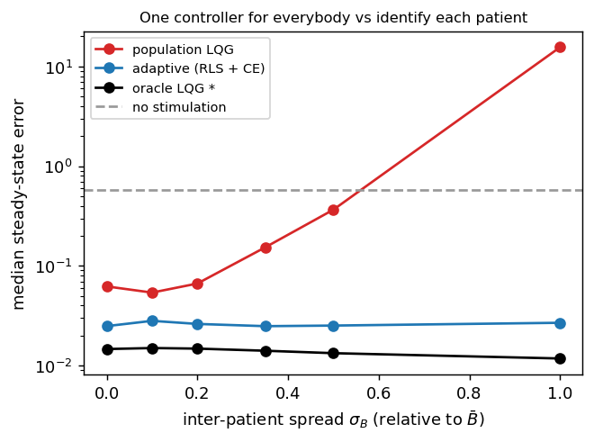
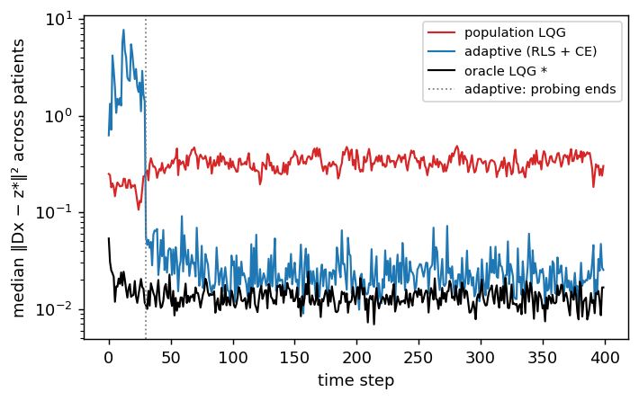
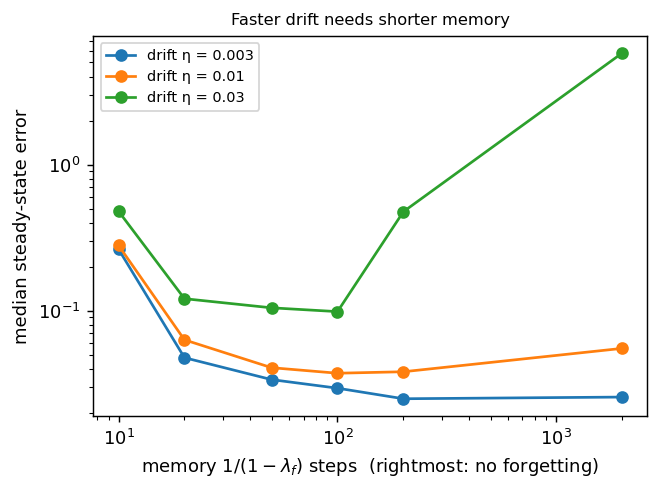

# Canonical formulation

[Home](index.md) · [Getting started](getting-started.md) · [User guide](user-guide.md) · [Nomenclature](nomenclature.md) · [Models](models/index.md) · [NeuroStim](neurostim.md) · [References](references.md)

This page strips closed-loop neurostimulation down to a standard
mathematical object:

> **Adaptive tracking over a population of random, slowly drifting,
> partially observed, controlled stochastic dynamical systems.**

Neurostimulation stops being the primitive. It becomes one instance of
stochastic control plus system identification. [NeuroStim](neurostim.md) and
[NeuroStim-Percept](neurostim-percept.md) are this problem with extra
nonlinearities. A runnable linear version lives in
`src/sentionaut/neurostim/canonical.py` and
`examples/neurostim_canonical_tutorial.py`. Every claim below that can be
checked numerically is checked there.

## 1. Variables and timescales

| Symbol | Meaning | Timescale | How it changes |
| --- | --- | --- | --- |
| $\theta_p$ | the patient: anatomy, electrode placement, connectivity, stimulation transfer | constant per patient | sampled once, $\theta_p \sim P_\Theta$ |
| $\phi_t$ | exogenous drift: interface, excitability, plasticity | minutes to months | $\phi_{t+1} = \rho\,\phi_t + \eta_t$, with $\rho \approx 1$ |
| $h_t$ | stimulation-induced adaptation or fatigue | seconds to minutes | $h_{t+1} = \rho_h h_t + \kappa \lvert u_t \rvert$, **driven by the control** |
| $x_t$ | fast neural state | milliseconds to seconds | the controlled dynamics |
| $u_t \in \mathbb R^m$ | stimulation on $m$ electrodes | per step | chosen by the policy |
| $o_t$ | what the implant measures | per step | $o_t = g(x_t) + v_t$ |
| $z_t$ | percept or behaviour | per step | $z_t = D(x_t)$ |
| $r,\ z^\star = E(r)$ | target image and its representation | per trial | $r \sim P_R$, **independent of** $\theta$ |

Two corrections to the informal picture:

- **Drift and adaptation are different objects.** $\phi_t$ is exogenous:
  the controller can only track it. $h_t$ depends on $u_t$: it is part of
  the state (so $x_t$ is really $(x_t, h_t)$), it can be predicted from the
  controller's own actions, and it can be planned around. Merging the two
  into "the brain drifts" hides the fact that one of them the policy causes.
- **The target is fixed per trial**, $r$, not a fresh $r_t$ every step. A
  percept has to be built and held, and that is what makes the problem one of
  tracking a set-point rather than of following noise.

## 2. Generative model

$$
\theta \sim P_\Theta,\qquad r \sim P_R,\qquad \phi_0 \sim P_\Phi,\qquad x_0 \sim P_{X_0}
$$

$$
x_{t+1} = f_{\theta,\phi_t}(x_t, u_t) + w_t,\qquad
o_t = g_{\theta,\phi_t}(x_t) + v_t,\qquad
z_t = D_\theta(x_t),\qquad
\phi_{t+1} \sim P(\phi_{t+1} \mid \phi_t)
$$

$$
u_t \sim \pi\left(u_t \mid z^\star, o_{\le t}, u_{<t}\right)
$$

The hidden state of the full control problem is
$s_t = (x_t, \phi_t, \theta)$. The three parts are fast, slow and fixed.
The policy never observes $\theta$, $\phi_t$ or $x_t$.

## 3. What "random patients" means

A patient is **not** a category label $p \in \{1,\dots,N\}$. A patient is an
independent draw of a whole dynamical system:

$$
\theta_p \overset{\text{iid}}{\sim} P_\Theta
\quad\Longrightarrow\quad
\mathcal M_p = \left(f_{\theta_p}, g_{\theta_p}, D_{\theta_p}\right) \sim P(\mathcal M).
$$

Training means learning to control **a random member of a family of
systems**, not patients 1, 2, 3 in turn. The objective averages over the
family:

$$
J(\pi) = \mathbb E_{\theta \sim P_\Theta}\,\mathbb E_{r \sim P_R}\,
\mathbb E_{\phi, w, v}\left[\sum_{t=0}^{T} \ell\left(z_t, z^\star\right) + \lambda \lVert u_t \rVert_R^2\right].
$$

Four consequences, each easy to miss:

1. **The Bayes-optimal policy acts on a belief.** Unknown $\theta$ makes
   this a Bayes-adaptive POMDP (Duff 2002). The sufficient statistic is the
   posterior $b_t = p(x_t, \phi_t, \theta \mid o_{\le t}, u_{<t})$. Meta-RL
   methods such as VariBAD (Zintgraf et al. 2020) approximate it with a
   learned encoder of the history. The calibration sweeps in the other
   tutorials are a hand-designed version of that encoder.
2. **The separation principle fails.** For a *known* linear-Gaussian system
   the optimal controller is a Kalman filter plus LQR (LQG). With unknown
   $\theta$, stimulation both controls the brain and teaches you about the
   patient. This is dual control (Feldbaum 1960): probing has value, and
   certainty equivalence (estimate, then act as if the estimate were true)
   is not optimal. The tutorial shows its failure mode: a heavy tail of
   episodes where a bad early estimate produces huge gains.
3. **Only the input–output map is identifiable.** $(A, B, C, D)$ and
   $(TAT^{-1}, TB, CT^{-1}, DT^{-1})$ produce identical data for any
   invertible $T$. Only the Markov parameters $D A^k B$ can be recovered. A
   controller needs nothing more, but "recover the patient's connectivity"
   is not a well-posed sub-goal.
4. **Within one patient, $\theta$ and $\phi_t$ can't be told apart.** Data
   only ever show the current system $\left(A_{\theta,\phi_t},
   B_{\theta,\phi_t}\right)$. The split matters through the *priors*:
   between-patient spread versus drift rate. It is useful when
   identification is much faster than drift, $T_{\mathrm{id}} \ll
   1/(1-\rho)$.

## 4. The linear canonical form

Take $f$ linear and let the drift enter the parameters. That gives a
linear-parameter-varying (LPV) system (Shamma & Athans 1991), where every
matrix has a stimulation meaning:

$$
x_{t+1} = A_{\theta,\phi_t}\, x_t + B_{\theta,\phi_t}\, u_t + w_t,\qquad
o_t = C_\theta x_t + v_t,\qquad
z_t = D_\theta x_t .
$$

| Matrix | Meaning |
| --- | --- |
| $A_\theta$ | endogenous dynamics and connectivity. Complex eigenvalues are oscillatory modes (rhythms) |
| $B_\theta$ | stimulation transfer: electrode currents to neural perturbation. Its inter-patient spread is **the** personalisation problem |
| $C_\theta$ | what the implant records |
| $D_\theta$ | neural state to percept |

The code uses $n = 6$ latents (three damped oscillatory modes), $m = 4$
electrodes and a 3-D percept. Patients are sampled as
$B_\theta = \bar B + \sigma_B\, b\, G$, with $G$ standard Gaussian and $b$ the
entry scale of $\bar B$, plus a small spread on $A$. Drift acts on $B$:
$B_t = B_\theta + \phi_t$.

**Reachability sets the floor on error.** At steady state
$z_{ss} = D(I-A)^{-1}B\,u =: G\,u$. The targets you can reach are
$G\,\mathcal U_{\mathrm{safe}}$. If $m < \dim z$, the best error for an
unconstrained input is $\lVert (I - GG^{+})\,z^\star \rVert^2 > 0$. This is
the linear counterpart of the autoencoder ceiling in
[NeuroStim-Percept](neurostim-percept.md). There the floor comes from
representation, here from actuation.

**Partial observation has a minimum memory.** An input–output model of an
order-$n$ system seen through $p$ outputs needs a lag of at least
$\lceil n/p \rceil$ (the observability index). With $o = Dx$ that is
$\lceil 6/3 \rceil = 2$, which is what the adaptive controller uses.

## 5. Where images enter: two generalisation axes

Images enter only through the target, $z^\star = E(r)$ with $r \sim P_R$, and
$P_R$ is **the same for every patient**: a common image set. So there are two
independent generalisation axes, plus their combination:

| Axis | Train | Test |
| --- | --- | --- |
| image | patient $\theta$, images $\mathcal I_{\mathrm{train}}$ | same $\theta$, unseen $r$ |
| patient | patients $\{\theta_i\}$, common images | new $\theta \sim P_\Theta$, familiar images |
| both | – | new $\theta$ **and** new $r$ |

**In the linear-quadratic problem, image generalisation is free.** The
optimal tracker is $u_t = u_{ss}(z^\star) - K\left(\hat x_t -
x_{ss}(z^\star)\right)$. Here $K$ does not depend on $z^\star$, and
$(x_{ss}, u_{ss})$ are linear in $z^\star$ as long as no constraint is
active. The policy is therefore affine in the target, and an unseen image is
no harder than a seen one. Image generalisation only becomes a real axis
when:

- $E$ or $D$ is nonlinear, for example images through a decoder;
- a constraint is active, $u \in \mathcal U_{\mathrm{safe}}$; or
- the policy is a learned function approximator.

[NeuroStim-Percept](neurostim-percept.md) has all three. There, the random
patient evaluation tests **both** axes at once: held-out patients on MNIST
test digits. Separating the two axes is an open item.

## 6. The canonical problem

**Population adaptive tracking of random dynamical systems.** Sample
$\theta \sim P_\Theta$ and $r \sim P_R$, and let $z^\star = E(r)$. The
system is

$$
x_{t+1} = A_{\theta,\phi_t} x_t + B_{\theta,\phi_t} u_t + w_t,\qquad
o_t = C_\theta x_t + v_t,\qquad
\phi_{t+1} = \rho\,\phi_t + \eta_t .
$$

Find

$$
\pi^\star = \arg\min_\pi\ \mathbb E_{\theta, r, \phi, w, v}
\left[\sum_{t=0}^{T} \lVert D_\theta x_t - z^\star \rVert_Q^2 + \lambda \lVert u_t \rVert_R^2\right]
\quad\text{s.t.}\quad u_t \in \mathcal U_{\mathrm{safe}},
$$

where $\pi$ may depend only on $(z^\star, o_{\le t}, u_{<t})$. This is a
Bayes-adaptive, partially observed, constrained stochastic control problem
over a population of slowly time-varying systems.

## 7. The ladder: add one difficulty at a time

Each rung adds exactly one source of difficulty. That lets a failure be
traced to its cause instead of to "biology".

| Rung | Adds | Where |
| --- | --- | --- |
| L0 | one known linear patient: LQG is optimal, a sanity check | `canonical.py` |
| L1 | random patients, $\theta \sim P_\Theta$ | `canonical.py` |
| L2 | partial observation, $o = Dx + v$ | `canonical.py` |
| L3 | slow drift, $\phi_t$ | `canonical.py` |
| L4 | control-dependent adaptation $h_t$, saturation $\tanh$, charge limits | [NeuroStim](neurostim.md) |
| L5 | nonlinear image readout $D$ = decoder, $E$ = encoder | [NeuroStim-Percept](neurostim-percept.md) |

Four controllers are compared, from least to most informed:

- **zero:** no stimulation.
- **population LQG:** one controller designed for the mean patient
  $(\bar A, \bar B)$.
- **adaptive:** recursive least squares with forgetting on an ARX model,
  then certainty-equivalent LQ tracking. It knows nothing about the patient.
- **oracle LQG \*:** knows $(A_\theta, B_\theta + \phi_t)$. It is optimal for
  L0–L2 and a lower bound on error for all rungs.

The table reports percept error $\lVert Dx - z^\star \rVert^2$ over the
second half of each episode, on 30 held-out patients (each with a target from
the common set). *Failure* means ending worse than not stimulating at all
(same patient, target and noise).

| level | controller | median error | mean error | failure rate |
| --- | --- | ---: | ---: | ---: |
| L0 known patient | zero | 0.5874 | 0.8140 | 0.00 |
| L0 known patient | population LQG | 0.0149 | 0.0180 | 0.00 |
| L0 known patient | adaptive (RLS + CE) | 0.0251 | 0.6663 | 0.03 |
| L0 known patient | oracle LQG * | 0.0149 | 0.0180 | 0.00 |
| L1 random patients | zero | 0.5738 | 0.8164 | 0.00 |
| L1 random patients | population LQG | 0.3661 | 9.8554 | 0.40 |
| L1 random patients | adaptive (RLS + CE) | 0.0252 | 0.0476 | 0.00 |
| L1 random patients | oracle LQG * | 0.0133 | 0.0324 | 0.00 |
| L2 + partial observation | zero | 0.5630 | 0.7915 | 0.00 |
| L2 + partial observation | population LQG | 0.5692 | 10.4198 | 0.53 |
| L2 + partial observation | adaptive (RLS + CE) | 0.0405 | 0.3486 | 0.07 |
| L2 + partial observation | oracle LQG * | 0.0149 | 0.0332 | 0.00 |
| L3 + drift | zero | 0.5972 | 0.8130 | 0.00 |
| L3 + drift | population LQG | 5.4302 | 17.1547 | 0.70 |
| L3 + drift | adaptive (RLS + CE) | 0.1357 | 4.1422 | 0.30 |
| L3 + drift | oracle LQG * | 0.0158 | 0.0330 | 0.00 |

Reading the ladder:

- **L0:** the population controller *is* the oracle, since all patients are
  the mean patient. The adaptive controller pays for not knowing that: its
  median error is 1.7× the oracle's.
- **L1:** one controller for everybody fails on 40 % of patients, ending
  worse than no stimulation (mean 9.9 against 0.8). Identifying each patient
  brings the median error to 0.025, within 2× of the oracle.
- **L2:** partial observation hardly hurts the oracle (a Kalman filter
  recovers $x$), but it hurts the learner. The median error rises 1.6× and
  failures appear (7 %).
- **L3:** drift is the hardest rung for the learner, with a median error of
  0.136, 9× the oracle, and 30 % failures. The medians are small but the
  means are large: certainty equivalence has a heavy tail of occasional
  catastrophic episodes. That tail is exactly what dual or robust control
  exists to remove.

## 8. Three experiments

**How different must patients be before personalisation pays?** Here,
never: the adaptive controller wins at every spread. Even at $\sigma_B = 0$
the population controller is 4× worse than the oracle (0.062 against
0.015), because patients still differ slightly in $A$ ($\sigma_A = 0.05$).
As $\sigma_B$ grows, the population controller's error climbs past no
stimulation near $\sigma_B \approx 0.55$. At $\sigma_B = 1$ it reaches 15.6,
27× worse than not stimulating: a feedback gain designed for the wrong $B$
pushes the state the wrong way. The adaptive controller's cost is flat in
$\sigma_B$, a fixed price for identification. A crossover would appear if
the identification cost were higher (shorter episodes, noisier data, more
electrodes).



**The cost of learning.** On a new patient the adaptive controller probes for
30 steps, and random stimulation drives the error far *above* no
stimulation (up to about 7). It then drops to within about 2× of the oracle
immediately after the first certainty-equivalent design. The probing
transient is the price of not knowing $\theta$. A better prior or smarter
exploration (dual control, meta-learning, the calibration sweeps of the other
tutorials) would make it shorter and gentler. The population controller never
learns: it settles about 20× above the oracle.



**Drift: memory against lag.** RLS with forgetting factor $\lambda_f$
averages over roughly $W = 1/(1-\lambda_f)$ steps. Over that window a
random-walk parameter moves about $\eta\sqrt W$, so the bias grows with
$\eta^2 W$. The estimation variance falls as $\sigma^2/W$. The optimum is
$W^\star \propto \sigma/\eta$: faster drift needs shorter memory. The data
agree within the grid's resolution. The best memory is 200 steps at
$\eta = 0.003$ and 100 steps at $\eta = 0.01$ and $0.03$. For the fastest
drift, no forgetting is catastrophic (error 5.8 against 0.10). Very short
memory (10 steps) is bad at every drift rate, because the variance term
dominates.



```bash
uv run python examples/neurostim_canonical_tutorial.py           # ~10 min
uv run python examples/neurostim_canonical_tutorial.py --quick   # ~1 min
```

## 9. Mapping to the code

| Symbol | `canonical.py` | [NeuroStim](neurostim.md) (`env.py`) | [NeuroStim-Percept](neurostim-percept.md) (`percept.py`) |
| --- | --- | --- | --- |
| $\theta$ | `Population.sample` → `Patient(A, B)` | `randomize_B`, `randomize_A` | `Brain.sample_patients` |
| $\phi_t$ | `drift`, `drift_decay` | `drift_std`, `drift_revert` | – |
| $h_t$ | – | `adapt_*` fields | `adapt_*` fields |
| $x_t$ | 6-D linear | 3-D, cubic term | 16-D, autoencoder code |
| $C$ | `observe="full"` / `"percept"` | `observation="full"` / `"partial"` | percept image + noise |
| $D$ | first 3 latents | identity | MNIST decoder |
| $E(r)$ | common target set `targets` | fixed $x^\star$ | MNIST encoder |
| $\mathcal U_{\mathrm{safe}}$ | box $\lvert u \rvert \le u_{\max}$ | box, charge, adaptation (costs) | box, charge projection |
| belief encoder | RLS estimate | DAgger calibration record | calibration sweep + hypernetwork |

## 10. What this abstraction leaves out

- **Patients are not i.i.d.** Real cohorts come with covariates (implant
  type, electrode positions, imaging). $P_\Theta$ should be conditional,
  $P(\theta \mid c)$, and that information is free identification.
- **The percept is rarely observed.** The canonical problem lets $o_t$
  include $z_t$, so the tracking error can be measured. In a prosthesis the
  percept is reported by the patient, sparsely, noisily and late. Without a
  model of $D$ the error is not even observable. This is probably the
  largest gap between the benchmark and the clinic.
- **Linear-Gaussian is a lens, not the model.** Saturation, thresholds,
  adaptation and constraints (L4–L5) break LQG optimality. There, model
  predictive control or learned policies replace Riccati equations.
- **Safety is enforced by clipping in the linear rungs.** In a constrained
  MDP (NeuroStim) it enters as a cost with a budget. A real system needs
  hard guarantees during exploration: safe probing is its own problem.

## References

- Kalman, R. E. (1960). A new approach to linear filtering and prediction
  problems. *J. Basic Engineering*, 82(1), 35–45.
- Feldbaum, A. A. (1960). Dual control theory I. *Automation and Remote
  Control*, 21, 874–880.
- Shamma, J. S., & Athans, M. (1991). Guaranteed properties of gain
  scheduled control for linear parameter-varying plants. *Automatica*,
  27(3), 559–564.
- Ljung, L. (1999). *System Identification: Theory for the User* (2nd ed.).
  Prentice Hall.
- Duff, M. O. (2002). *Optimal learning: computational procedures for
  Bayes-adaptive Markov decision processes*. PhD thesis, UMass Amherst.
- Åström, K. J., & Wittenmark, B. (2008). *Adaptive Control* (2nd ed.).
  Dover.
- Zintgraf, L., et al. (2020). VariBAD: a very good method for Bayes-adaptive
  deep RL via meta-learning. *ICLR*.
