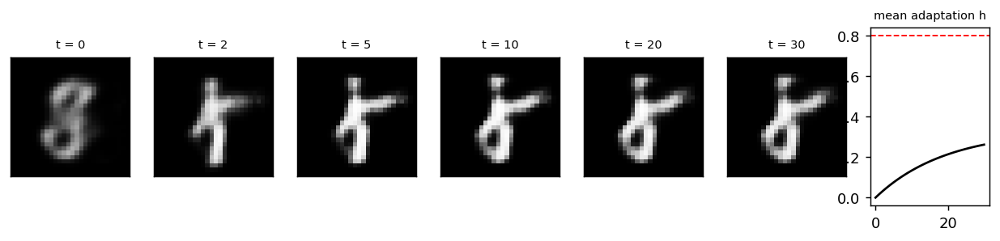
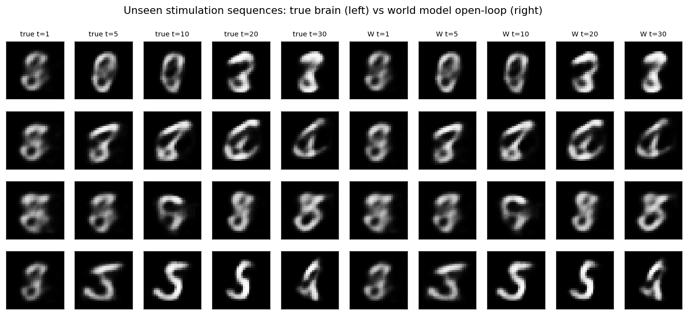
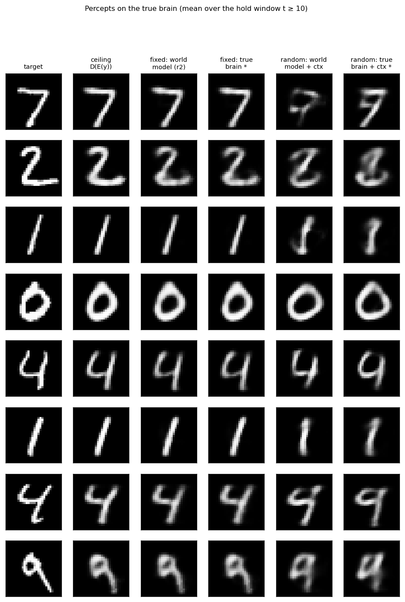
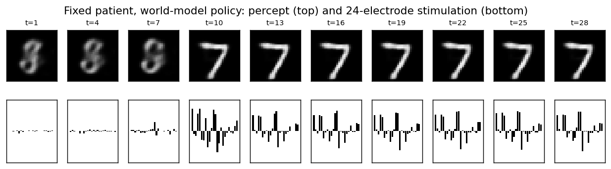

# NeuroStim-Percept: image targets through a world model

[Home](index.md) · [Getting started](getting-started.md) · [Nomenclature](nomenclature.md) · [Models](models/index.md) · [NeuroStim](neurostim.md) · [References](references.md)

In [NeuroStim](neurostim.md) the target was a point in a 3-D latent space.
Here it is an **image**. Stimulation drives a 16-D neural state, and a frozen
decoder turns that state into a percept. The stimulation policy is learned by
backpropagating a **reconstruction loss** through a **learned world model**,
never through the brain itself. There is no RL.

Source: `src/sentionaut/neurostim/percept.py` · Tutorial:
`examples/neurostim_percept_tutorial.py`

## Pipeline

```text
target y ─► π(E(y), ctx) ─► a_{1:T} ─► brain ─► x_t ─► D(x_t)          (evaluation: true percept)
                                  └──► W(z_0, ctx, a) ─► ẑ_t ─► D(ẑ_t)  (training: predicted percept)

loss = Σ_{t ≥ 10} ‖D(ẑ_t) − y‖²  + λ · charge
```

| Part | What it is | Learned from |
| --- | --- | --- |
| `D`, `E` | MNIST autoencoder with a 16-D code: the neural state space and the percept readout (`brain2vision`) | MNIST, then frozen |
| Brain | NeuroStim dynamics in that code space: `x_{t+1} = A x − αx³ + B diag(1/(1+λh)) tanh(a) + w`, 24 electrodes, adaptation, charge limit `Σ|a| ≤ 8` | – (ground truth, a black box) |
| `W` (world model) | GRU. From the resting percept (and a patient context) it predicts the open-loop latent trajectory, decoded by `D` | observed (stimulation, percept) episodes only |
| `π` (policy) | MLP: `E(y)` (+ context) → a 30-step, 24-electrode stimulation sequence; `tanh` bound and charge projection | backprop through `W` on MNIST train images |
| classifier | frozen MLP on MNIST; the accuracy on percepts answers "is the digit recognisable?" | MNIST |

`W` is allowed to use `D`. The percept readout stands in for a known
`brain2vision` model, like the repo's phosphene models. What `W` must learn
is the patient-specific part: stimulation → neural state, including
adaptation.

## Fixed vs random patients

- **Fixed patient.** One `B`. `W` is fitted on 6 000 exploration episodes
  (i.i.d. noise, held patterns, smooth drifts), then the policy is trained
  through it. **Round 2** stimulates the true brain with the round-1 policy,
  adds those episodes and refits `W` and `π`. The model has to be accurate
  where the policy actually operates, and round 2 makes it so.
- **Random patients.** A new `B` for every episode. A **calibration sweep**
  pulses each electrode once from rest. The encoded percept changes, 24 × 16
  numbers, form a noisy view of `B`. They condition `W` and `π` through a
  **hypernetwork**: the patient multiplies the action (`B a`), so the context
  emits the matrix the action is multiplied by. Concatenating the context
  with the action failed (about 10 % accuracy).
- **Privileged reference `*`.** The same policy trained by backprop through
  the **true** brain. The gap between it and the world-model policy is what
  the world model costs.

## Tutorial

```bash
uv run python examples/neurostim_percept_tutorial.py           # ~45 min, 4 CPU cores
uv run python examples/neurostim_percept_tutorial.py --quick   # ~1 min smoke run
```

Holding one random stimulation pattern: the percept forms within a few steps.
Adaptation keeps building, but in 30 steps it stays well below `h_max`, so
there is little visible fading.



World model vs true brain on stimulation sequences it never saw (open-loop
from the resting percept):



Percepts the true brain produces for held-out test digits (mean over the hold
window):



One stimulation sequence and its percept over time (fixed patient). The
policy barely stimulates for the first 9 steps and switches on at `t = 10`,
exactly when the loss window starts. It learned to save charge and
adaptation for the steps that are scored.



### Results

1 000 MNIST test digits, evaluated on the true brain. Random patients use
1 000 held-out patients, one per digit. Pixel MSE and classifier accuracy are
computed on the percept over the hold window (`t ≥ 10`). Charge is `Σ|a|`
per step.

| setting | policy | pixel MSE | classifier accuracy | charge | h > h_max |
| --- | --- | ---: | ---: | ---: | ---: |
| any | ceiling D(E(y)) (latent reached exactly) | 0.0106 | 0.950 | 0.00 | 0.000 |
| fixed patient | no stimulation | 0.0738 | 0.089 | 0.00 | 0.000 |
| fixed patient | policy via world model (round 1) | 0.0156 | 0.934 | 4.42 | 0.000 |
| fixed patient | policy via world model (round 2) | 0.0143 | 0.935 | 4.35 | 0.000 |
| fixed patient | policy via true brain * | 0.0139 | 0.929 | 3.95 | 0.000 |
| random patients | no stimulation | 0.0738 | 0.089 | 0.00 | 0.000 |
| random patients | fixed-patient policy (no personalisation) | 0.1020 | 0.103 | 4.35 | 0.000 |
| random patients | world model + calibration context | 0.0470 | 0.601 | 2.51 | 0.000 |
| random patients | true brain + calibration context * | 0.0417 | 0.664 | 1.91 | 0.000 |

## Reading the results

- **Fixed patient: the world model is almost free.** A policy trained only
  through `W` reaches 93.4 % accuracy (MSE 0.0156). Round 2 on-policy data
  brings MSE to 0.0143, against 0.0139 for the privileged reference. All
  three sit close to the autoencoder ceiling `D(E(y))` (95.0 %, MSE 0.0106),
  the best any stimulation can do.
- **Random patients: personalisation is the bottleneck, not the world
  model.** The world-model policy reaches 60.1 %, its privileged counterpart
  66.4 %, and both are far below the fixed-patient 93 %. One network has to map
  every calibration record to a good stimulation, in effect an amortised
  pseudo-inverse of `B`. A policy tuned to one patient is worse than no
  stimulation on another (MSE 0.102 vs 0.074).
- **Adaptation hardly binds here** (`h > h_max` stays at 0). The charge limit
  and the 30-step horizon keep drive modest. Longer holds or a lower
  `h_max` would make it bind.

## Caveats and next steps

- The policy is **open-loop**: one sequence per target. A closed-loop
  policy, feeding back observed percepts, would correct drift and model
  error online.
- `W` gets `D` for free. Learning a separate decoder from images alone is a
  harder and more honest setting. Then `W` becomes a small image world
  model, like the repo's learned transformer.
- The random-patient gap should shrink with more calibration (repeated or
  graded pulses), per-patient fine-tuning of `π` through `W` (test-time
  optimisation), or explicit identification of `B` from the probe. Each is
  a one-function change.
- On a real patient you cannot backprop through the brain. That is why only
  the world-model rows are methods; the `*` rows are yardsticks.
