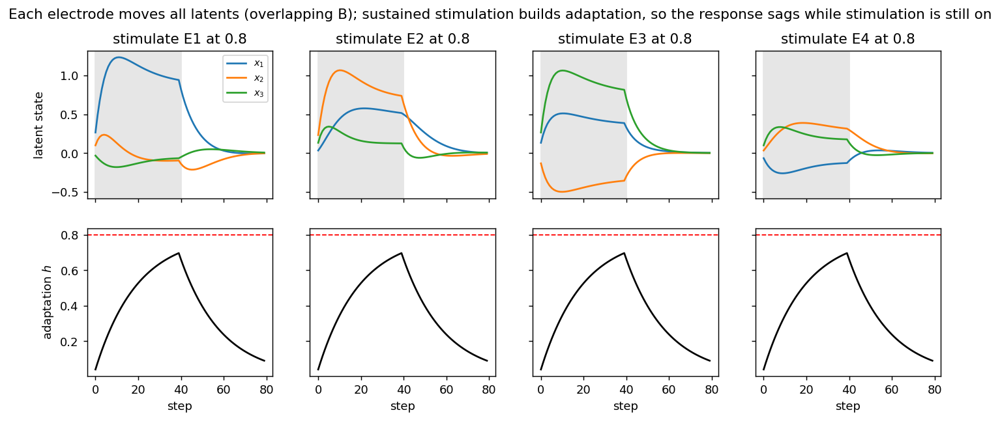
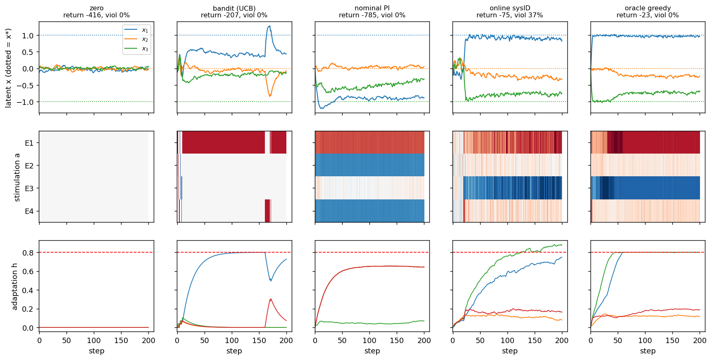
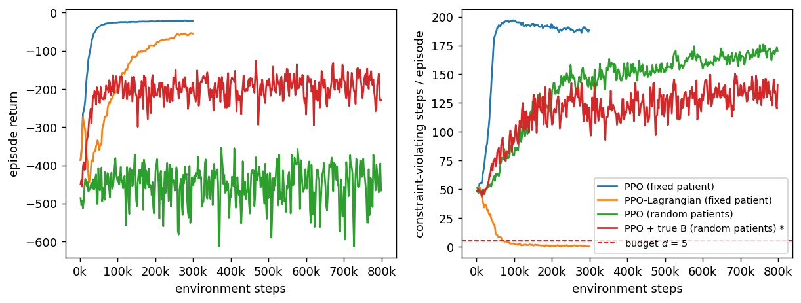

# NeuroStim: closed-loop control benchmark

[Home](index.md) · [Getting started](getting-started.md) · [Nomenclature](nomenclature.md) · [Models](models/index.md) · [NeuroStim](neurostim.md) · [References](references.md)

A tiny **constrained POMDP** for closed-loop neurostimulation. It is not a
biophysical model. It is the smallest system that keeps what makes
stimulation control an RL problem and not a bandit: stimulation changes a
*persistent* neural state, the electrode→state map is unknown and overlapping,
repeated stimulation adapts, and safety is a constraint, not a penalty.

Source: `src/sentionaut/neurostim/` · Tutorial: `examples/neurostim_tutorial.py`

## Model

Latent state `s_t = (x_t, h_t, B_t)`: neural state `x ∈ R³`, per-electrode
adaptation `h ∈ R⁴`, recruitment matrix `B ∈ R^{3×4}` (the "patient").

```text
x_{t+1} = A x_t − α x_t³ + B_t · diag(1/(1+λ h_t)) · tanh(a_{t−δ}) + w_t
h_{t+1} = ρ h_t + κ |a_t|                                   (ρ=0.95, κ=0.05, λ=2)
B_{t+1} = B_t + θ (B_0 − B_t) + η_t                         (drift, optional)
o_t     = C x_t + ε_t
r_t     = −‖x_{t+1} − x*‖² − w_E ‖a_t‖² − w_Δ ‖a_t − a_{t−1}‖²,   x* = (1, 0, −1)
```

Constraints, returned as `info["cost"]` (1 if any is violated this step) and
`info["cost_terms"]` (the size of each violation):

- charge `Σ_i |a_t^i| ≤ q_max = 2`
- adaptation `max_i h_t^i ≤ h_max = 0.8`
- `|a^i| ≤ 1` is enforced by clipping

The problem is `max_π E[Σ γ^t r_t]` s.t. `E[Σ c_t] ≤ d`. The default `B` is
the overlapping matrix from the design note, scaled by `stim_gain = 0.5`.
With that scale the target costs moderate charge, and holding it pushes the
most-used electrodes against `h_max`.

## Difficulty axes and presets

Every axis is a field of `NeuroStimConfig`, and any preset can be overridden.

| Axis | Easy | Hard | Field |
| --- | --- | --- | --- |
| Observability | `o = x` | 2 mixed biomarkers for 3 latents | `observation`, `obs_noise` |
| Stimulation map | diagonal `B` | overlapping `B`, new patient per episode | `mapping`, `randomize_B` |
| Temporal | immediate | delay `δ` + adaptation | `delay`, `adaptation` |
| Nonstationarity | fixed | `B_t` drifts, random `A` | `drift_std`, `randomize_A` |

| Preset | Setting |
| --- | --- |
| `NeuroStim-Easy-v0` | diagonal `B`, no adaptation, noiseless full observation |
| `NeuroStim-v0` | **canonical**: overlapping, random per-patient `B`, adaptation, constraints, noisy full observation |
| `NeuroStim-Hard-v0` | + partial observation, delay 2, random `A`, drifting `B` |

```python
from sentionaut.neurostim import make

env = make("NeuroStim-v0")               # or make("NeuroStim-v0", delay=3, drift_std=0.01)
obs, info = env.reset(seed=0)            # each seed is a new patient
obs, r, terminated, truncated, info = env.step(env.action_space.sample())
info["cost"], info["cost_terms"]         # CMDP constraint signals
info["x"], info["h"], info["B"]          # privileged latents (for oracles and plots only)
```

The API follows Gymnasium's (`reset → (obs, info)`, 5-tuple `step`) but does
not depend on it. A `gymnasium.Env` wrapper is a few lines if you need one.

## Baselines

`sentionaut.neurostim.baselines` (policies marked `*` read the latent state):

| Policy | Idea | Uses |
| --- | --- | --- |
| `zero`, `random` | floor | – |
| `bandit (UCB)` | UCB1 over single-electrode pulses; ignores state | reward only |
| `nominal PI` | PI feedback through `pinv(B_population)`: a "universal" controller | obs + population `B` |
| `online sysID` | probe, then RLS-with-forgetting estimate of `(A, B)`, then certainty-equivalent control | obs + `target_obs` |
| `oracle greedy *` | one-step optimal drive, given true `x, h, A, B_t` and actions in flight; enforces both constraints | latent state |
| `PPO` / `PPO-Lagrangian` | MLP on a `(o, a_prev)` history window; the Lagrangian version learns a multiplier on the violation budget | obs history |

`oracle greedy` is **not** an upper bound. It is myopic about adaptation: it
drives the best-aligned electrodes into `h_max` and then loses the target
(see the figure below). Unconstrained PPO beats its return on a fixed patient.

## Tutorial

```bash
uv run python examples/neurostim_tutorial.py            # ~6 min on 1 CPU core
uv run python examples/neurostim_tutorial.py --quick    # ~20 s smoke run
```

**1. Probe one patient open loop.** Each electrode moves all three latents,
so none of them controls one variable alone. Holding stimulation on builds
`h`, and the response sags while stimulation is still on.



**2. One held-out patient, five controllers.** The bandit locks onto one
electrode and pins it at `h_max`. Nominal PI assumes the population `B`, so it
drives this patient the wrong way. Online sysID finds the patient after about
20 probe steps but cannot see `h`, so it breaks the adaptation constraint. The
oracle holds the constraints, but it is myopic: E1 and E3 saturate at `h_max`
and `x₃` drifts off target.



**3. RL.** Unconstrained PPO on a fixed patient reaches the best return by
breaking a constraint ~95 % of the time. PPO-Lagrangian stays inside the
budget at about 2× the tracking error. Across random patients, PPO with a
16-step history learns nothing. The same PPO given the true `B` learns a
usable controller. So the bottleneck is **identifying the patient**, not
controlling one.



### Results

30 held-out patients (seeds 1000–1029). Return is mean ± s.e. Steady-state
error is `‖x − x*‖²` averaged over the last 50 of 200 steps. Violation rate is
the fraction of steps that break a constraint. Charge is `Σ|a|` per step.

| setting | policy | return | steady-state error | violation rate | charge |
| --- | --- | ---: | ---: | ---: | ---: |
| NeuroStim-Easy-v0 | zero | -406.0 ± 1.7 | 2.026 | 0.000 | 0.00 |
| NeuroStim-Easy-v0 | random | -448.7 ± 5.7 | 2.193 | 0.000 | 0.99 |
| NeuroStim-Easy-v0 | bandit (UCB) | -257.4 ± 12.0 | 1.248 | 0.000 | 0.79 |
| NeuroStim-Easy-v0 | nominal PI | -3.2 ± 0.3 | 0.001 | 0.000 | 1.04 |
| NeuroStim-Easy-v0 | online sysID | -47.7 ± 1.5 | 0.008 | 0.000 | 0.94 |
| NeuroStim-Easy-v0 | oracle greedy * | -3.1 ± 0.2 | 0.002 | 0.000 | 1.01 |
| NeuroStim-v0 | zero | -406.2 ± 1.5 | 2.032 | 0.000 | 0.00 |
| NeuroStim-v0 | random | -438.3 ± 4.9 | 2.125 | 0.000 | 0.99 |
| NeuroStim-v0 | bandit (UCB) | -197.8 ± 12.0 | 0.897 | 0.000 | 0.79 |
| NeuroStim-v0 | nominal PI | -911.8 ± 114.0 | 4.382 | 0.029 | 2.00 |
| NeuroStim-v0 | online sysID | -88.3 ± 8.4 | 0.235 | 0.203 | 1.58 |
| NeuroStim-v0 | oracle greedy * | -38.1 ± 6.8 | 0.209 | 0.000 | 1.73 |
| NeuroStim-Hard-v0 | zero | -404.1 ± 2.1 | 2.009 | 0.000 | 0.00 |
| NeuroStim-Hard-v0 | random | -439.1 ± 7.4 | 2.162 | 0.000 | 0.99 |
| NeuroStim-Hard-v0 | bandit (UCB) | -588.2 ± 39.7 | 2.583 | 0.000 | 0.66 |
| NeuroStim-Hard-v0 | nominal PI | -1176.2 ± 135.5 | 5.828 | 0.047 | 2.00 |
| NeuroStim-Hard-v0 | online sysID | -508.7 ± 56.5 | 1.649 | 0.077 | 1.51 |
| NeuroStim-Hard-v0 | oracle greedy * | -40.3 ± 7.3 | 0.188 | 0.000 | 1.73 |
| v0, fixed B | nominal PI | -27.6 ± 0.5 | 0.124 | 0.056 | 1.97 |
| v0, fixed B | online sysID | -75.5 ± 4.9 | 0.167 | 0.553 | 1.79 |
| v0, fixed B | oracle greedy * | -22.8 ± 0.4 | 0.116 | 0.000 | 1.97 |
| v0, fixed B | PPO (fixed patient) | -19.4 ± 0.3 | 0.090 | 0.946 | 2.56 |
| v0, fixed B | PPO-Lagrangian (fixed patient) | -44.3 ± 0.5 | 0.227 | 0.000 | 1.07 |
| NeuroStim-v0 | PPO (random patients) | -518.9 ± 65.3 | 2.270 | 0.850 | 2.64 |
| NeuroStim-v0 | PPO + true B (random patients) * | -157.0 ± 16.2 | 0.747 | 0.532 | 1.80 |

## Design notes and caveats

- **Bandit boundary.** Set `A = 0` and turn off adaptation. Then `x_{t+1}`
  depends only on `a_t`, and the task becomes a contextual bandit or
  Bayesian-optimisation problem. RL is justified by state persistence,
  stimulation history (`h`, delay) and the need to identify the patient
  within an episode.
- **Cycling electrodes does not pay off here.** With concave recruitment
  (`tanh`) and slow, linear adaptation, a constant spread of charge beats
  cycling between electrodes. The average of `h` equals the duty cycle, and
  by Jensen `tanh(d) ≥ d·tanh(1)`. Sequences such as E3→E1→E4 would pay off
  only with convex (threshold-like) recruitment, or with recovery that is fast
  compared to the cycle. If that behaviour matters, change `g`.
- **Reward uses the latent `x`.** That is fine in simulation, but a real
  system only sees a biomarker. The partial-observation preset makes this gap
  show.
- **Universal vs personalised.** A universal policy is trained offline across
  `p(B)`. A personalised one identifies the patient online. The comparison
  between them is the scientific core. The privileged-`B` PPO run bounds what
  identification could buy. It is a diagnostic, not a method.
- **PPO here is a baseline, not a tuned agent.** A recurrent or
  meta-RL policy (RL², a context encoder), model-based RL, or dual control
  are the natural next steps.
